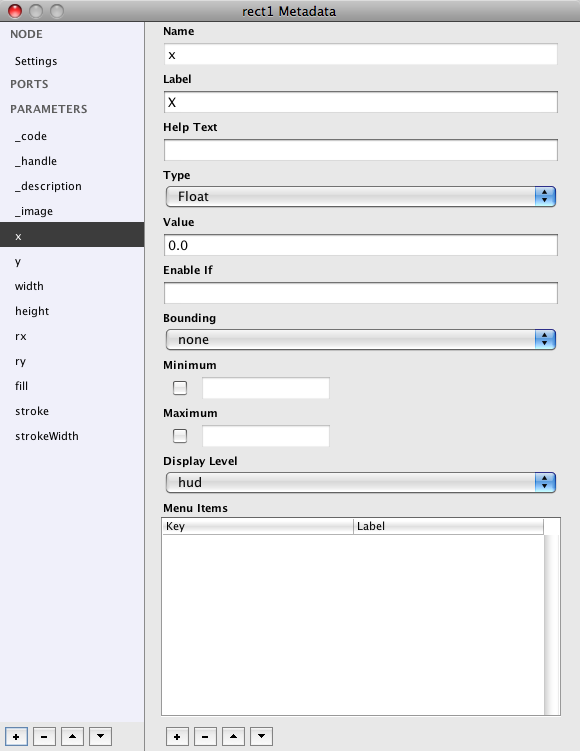

Sometimes you want **a node to have a specific parameter**. Say that you would like to **implement a seeding parameter** or **a second stamp expression** to a node, or that you have just completed a [Geonet](geonets.html) and would like to **introduce a parameter for controlling it** in the root window.. 

Handy for all these operations is the **Metadata panel**. You can access it by pressing the Metadata button on top of the Parameters pane. Let's have a look at it. Create a **Rect** node, select it and press the Metadata button. You should see this:

Listed are specifications of the node and its parameters. 

* NODE / Setttings: is used for **exporting nodes**. More information on the topic is on the [programming-nodes](/documentation/advanced/programming-nodes.html) page.
* PORTS / Only for filter nodes. Lists the name of all ports, mostly 1 calles **shape**.
* PARAMETERS / general node parameters:

		* code /
		* handle / points out to the handles attached to the node.
		* description / points to the information given when creating a new node.
		* image / points to the icon used to visualize the node in the network.
		
* PARAMETERS / node specific parameters. (all parameters as seen in the Parameters panel). In case of the Rect node:

		* x / the x location of the rectangle.
		* y / the y location of the rectangle.
		* width / the width of the rectangle.
		* height / the height of the rectangle.
		* + rx, ry, fill, stroke and strokeWidth.

Important to notice is that parameters have a type. The general node parameters always have the same type:

* code and  handle: **type Code**.
* description: **type String**.
* image: **type String**.

Node specific parameters in case of the rect node: 

* numerical values (like widht, height, x and y, .. ) have **type Float**.
* fill and stroke have **type Color**.

Creating a new parameter.
-------------------------

On the lower left corner of the Metadata pane is a small interface for creating new parameters. 

* Click on the "+" button and select Parameter.
* Give it a name.
* Give it the according type.
* Close the Metadata pane.

Have a look at the Parameters pane. The new parameter should be added to it and should have been given a matching widget. Matching in that sense that is should have picked the right widget for the type which you have given it.

Changing the code.
------------------

You might have noticed that all parameters are referred to in the code by their name with a **prefix of self**. Sometimes a new parameter involves some changes in the code. For more informations on changing code read the [programming node](/documentation/advanced/programming-nodes.html) page. 
