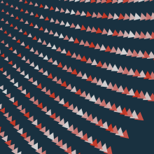
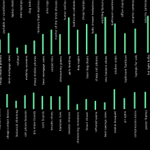
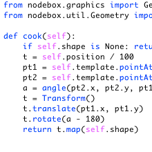

  
  

    <h4>An experimental and fun program to explore data visualization.</h4>
  

    <a href="/download/" class="hero-button">Download</a>
    <small>&nbsp;or&nbsp;</small>
    <a href="/documentation/tutorial/getting-started.html" class="hero-button yellow">Get Started</a>
  

  

    
  

  

    <h3>A Friendly Face</h3>
    
You want to explore generative design without learning the ins and outs of programming?

    
Using its node-based interface, NodeBox makes generative design easy and fast.

  

  

    
   

  

    <h3>An Animated Partner</h3>
    
Every parameter in NodeBox can be animated. Animations can be exported as common movie formats or as a sequence of images.

  

  
  

    
  

  

    <h3>Visualize Your Data</h3>
    
Because of its unique approach, NodeBox is ideal for rapid data visualization.

    
NodeBox takes in data from Excel. Because it's open, you can write your own data importers and exporters.

  

  

    
   

  

    <h3>Peek Under The Hood</h3>
    
Using nodes doesn't have to mean giving up power.

    
NodeBox makes it trivial to customize the functionality of existing nodes or to build your own from scratch.

  

  

    
  

