This is important:
==================
We're currently rewriting the graphics API to be more performant. **Code that access nodebox.graphics will break**. Other code that uses generic Python libraries should be okay.

---

Once you get the hang of it, it becomes fairly easy to build networks and hide lengthy procedures behind a subnetwork facade. However, sometimes there are cases where you wish you could write your own nodes. 

Maybe you want to reuse a cool piece of code in NodeBox that you've written. Maybe NodeBox is missing some key piece of functionality that you need. Or maybe you just want to experiment with writing a new node from scratch. This tutorial shows you how.

Creating a new node from existing code.
=======================================
First off, let's build a node that does something really simple like adding two numbers together. We won't write our own code yet but we'll reference some code that already exists inside NodeBox. This is really easy. To get started:

- Create a new [node node](/node/reference/core/node.html). It will automatically be named node1. This is the most basic of the available nodes and it's also the one from which all other nodes are derived. All it does is output 0.0. Basically it acts as a *blank slate*.
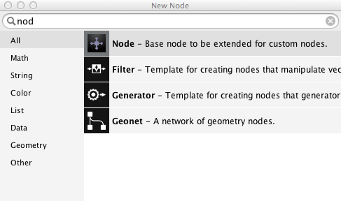
<small>Locating the 'node' node inside the node selection dialog.</small>

- With **node1** selected, press the **Metadata button** on top of the parameter panel. This will bring up the metadata panel.

The metadata panel always relates to one specific node, in this case node1. The items on the left relate to node and port settings. What they mean becomes clearer when we have some ports to work with. Since we want to add 2 numbers we need 2 ports:

- Press the + button below the left sidebar.
- In the dialog that appears, enter **value1** in the name field and choose **float** as the type. Then press **Ok**. This creates a new port and brings up an overview of its metadata.
- Repeat the previous step to add a port named **value2**. Note that each time you add a new port, the parameter panel adds a new parameter field widget below the last one. With the metadata panel open it's not yet possible to change their values.
- Press **Ok** to apply the changes. You can now drag the **value1** and **value2** numbers but the viewer still shows 0.0. We have to tell our node what to do exactly with those values:
- With node1 still selected press the **Metadata** button again.
- On the left, choose **Settings**. The **Function** field contains by default the value 'core/zero'. This means that the node refers to a *function* named zero and this function resides in a *namespace* called core. A namespace can be seen as some kind of container of functions that are related to each other. For example the namespace 'math' contains functions like add, multiply, sin, cos, etc...
- Change the value of **Function** to **math/add**.
- Change the value of **Description** to **Add two numbers.**
- Press **Ok** to close the metadata panel.

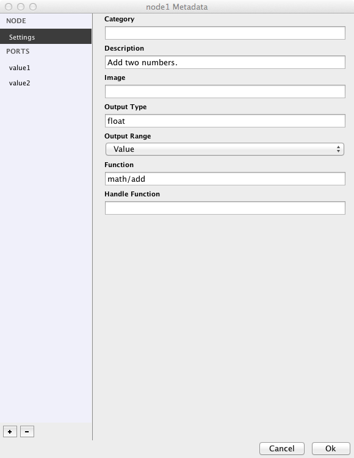
<small>An overview of node and port settings in the Metadata panel</small>

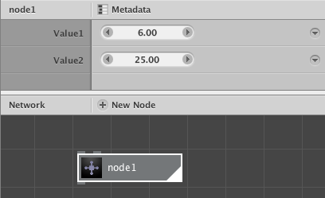
<small>A node that we made from scratch</small>

You can now drag the value1 and value2 values around and see the results change in the viewer: the two values are added together. If you return to the metadata panel and change the value of Function to math/multiply, you will see that the two values are being multiplied instead. 

To summarize:
- A node is related to a function.
- The input ports of a node relate to the arguments of that function (therefore: 2 arguments = 2 ports).
- What comes out of the output port of a node is the result (or return value) of that function.

If you want to, you can rename your 'node1' node to something more comprehensible, like 'add' or 'multiply' (by right clicking and choosing rename)

Adding node with custom Python code.
====================================

We're now going to look how you can link to an external piece of Python code.

- First off, create a new folder on your hard disk. It's important to do this first because NodeBox files store **dependencies** (meaning references to external pieces of code) relative to your NodeBox document file.
- Create a new document in NodeBox and save it as **pylib.ndbx** in the new folder. If you don't save the file, NodeBox won't allow you to *import* any code dependencies.
- Now open up a text editor and write some Python:

<pre><code>def evaluate(expr, x, y, z):
    ns = {"x": x, "y": y, "z": z}
    exec "from math import *" in ns
    return eval(expr, ns)</code></pre>

This snippet evaluates a mathematical expression with at most 3 arguments and returns the result.

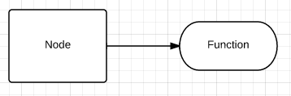

It's important to keep in mind that NodeBox uses a [*functional coding model*](http://en.wikipedia.org/wiki/Functional_programming). Every node computes a value from a set of inputs you give it and the same set of inputs will always yield the same value. So we always use a *named function* (in the above case it's called evaluate) that takes a certain amount of *arguments* (here there's four: expr, x, y and z). In the functions body some work goes on and the function *returns one value*. Please try to stick to this when you write some code yourself.

- Save the file as **mycode.py** in the folder where you stored **pylib.ndbx**.

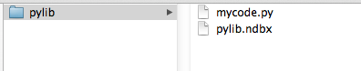
<small>A typical NodeBox library structure</small>

You can now import the **mycode.py** file in NodeBox:
- Go to **File > Code Libraries** (a new dialog will show up).
- Press the **+ button** and choose **Python**.
- In the file dialog **select mycode.py**.
- **Close** the dialog.

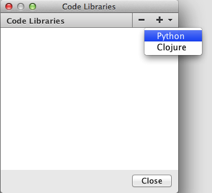

You can now create a node based on this code:
- Create a new [node node](/node/reference/core/node.html).
- You can give the node a new name already; this will be our **eval** node.
- With the node selected, press the **Metadata** button.
- In the **Settings** section, change the text in the **Function** field to **mycode/evaluate**. You probably remember from before that we're linking the node to a function called evaluate that resides in a namespace called mycode. Notice that in the network view an error message is shown now: **eval: evaluate() takes exactly 4 arguments (0 given)**. This is because the node already tries to access the function but it has no ports yet so there is nothing to compute. Let's fix this:
- Press the + button below the sidebar on the left.
- Name your first port **expr** and select the **string** type in the dropdown.
- Press **Ok**. If you want to, more port tweaking can be done at this point, but it's not necessary for this tutorial.
- Repeat these steps 3 more times for the following ports:
    - name **x**, type float
    - name **y**, type float
    - name **z**, type float
- Press **Ok** to close the metadata panel.
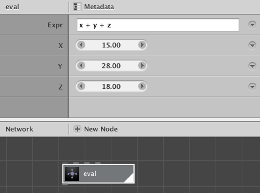

Great! Our node is now fully functional. Let's try it out with a couple of expressions:
- x + y + z
- pow(x, 2) - y\*20
- sin(radians(x)) + cos(radians(y))
- x \* pi

As you can see the expression gives us access to the values of the 3 parameters x, y and z, but also to all the mathematical operations that the python **math package** provides.

Suppose now that you want to add a 4th expression variable, named **a**:

- Change the evaluate function to something like this and **remember to save**:
<pre><code>def evaluate(expr, x, y, z, a):
    ns = {"x": x, "y": y, "z": z, "a": a}
    exec "from math import *" in ns
    return eval(expr, ns)</code></pre>
Our code has changed but NodeBox is not aware of it yet.
- Go to **Node > Reload** or press **Cmd+R** (**Ctrl+R** on Windows). This *reloads* the file in NodeBox but will pose a new problem: our number of arguments has changed so we have to add a new port again:
- Go to **Metadata**.
- Press the + button.
- Add a new port with name **a** and of type **float**.
- Press **Ok** to close the port dialog and again to close the Metadata panel.

Building a shader node.
=======================
Let's build a node that calculates the brightness of an object at a specified location relative to a light source at another location. The source for this node is taken from the [Colors library](http://nodebox.net/code/index.php/Colors) that was made for NodeBox 1. The source code is written in Python, so we can also use it in NodeBox 3.

- First create a new folder **shader** somewhere on your hard drive.
- Create a new text file **shader.py** inside this folder.
- Put the following code inside shader.py:

<pre><code>from math import degrees, atan2, sqrt
def shader(position, source, radius=300, angle=0, spread=90):

    """ Returns a 0.0 - 1.0 brightness adjusted to a light source.

    The light source is positioned at dx, dy.
    The returned float is calculated for x, y position
    (e.g. an oval at x, y should have this brightness).

    The radius influences the strength of the light,
    angle and spread control the direction of the light.

    """

    if angle != None:
        radius *= 2

    x = position.x
    y = position.y

    dx = source.x
    dy = source.y

    # Get the distance and angle between point and light source.
    d = sqrt((dx-x)**2 + (dy-y)**2)
    a = degrees(atan2(dy-y, dx-x)) + 180

    # If no angle is defined,
    # light is emitted evenly in all directions
    # and carries as far as the defined radius
    # (e.g. like a radial gradient).
    if d &lt;= radius:
        d1 = 1.0 * d / radius
    else:
        d1 = 1.0
    if angle == None:
        return 1-d1

    # Normalize the light's direction and spread
    # between 0 and 360.
    angle = 360-angle%360
    spread = max(0, min(spread, 360))
    if spread == 0:
        return 0.0

    # Objects that fall within the spreaded direction
    # of the light are illuminated.
    d = abs(a-angle)
    if d &lt;= spread/2:
        d2 = d / spread + d1
    else:
        d2 = 1.0

    # Wrapping from 0 to 360:
    # a light source with a direction of 10 degrees
    # and a spread of 45 degrees illuminates
    # objects between 0 and 35 degrees and 350 and 360 degrees.
    if 360-angle &lt;= spread/2:
        d = abs(360-angle+a)
        if d &lt;= spread/2:
            d2 = d / spread + d1
    # Wrapping from 360 to 0.
    if angle &lt; spread/2:
        d = abs(360+angle-a)
        if d &lt;= spread/2:
            d2 = d / spread + d1

    return 1 - max(0, min(d2, 1))</code></pre>
Note that we have one function here named *shader* that takes 5 arguments (*position*, *source*, *radius*, *angle* and *spread*). The function returns a number between 0 (dark) and 1 (bright).
- Next, create a new NodeBox document and save it inside the shader folder as **shader.ndbx**.
- Go to **File > Code Libraries**, press the + button and choose Python.
- Locate the shader.py file and load it in.

Now it's time to create the actual node:

- Add a new [node node](/node/reference/core/node.html). Rename this node to **shader**.
- Inside the metadata panel, add 5 new ports:
    - **position** (of type point)
    - **source** (of type point)
    - **radius** (of type float)
    - **angle** (of type float)
    - **spread** (of type float)
- In the node **Settings**, in the **Function** field write down **shader/shader**.
- Close the metadata panel.

In the parameter panel, give this new shader node the following values:
- **Position**: leave as is
- **Source**: 0, -300
- **Radius**: 245
- **Angle**: 275
- **Spread**: 90

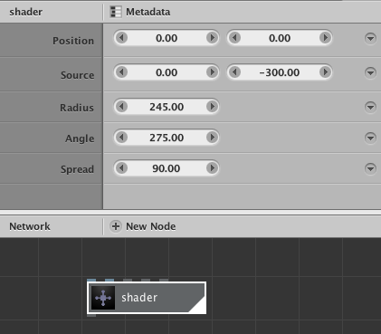

The shader node only computes values, let's create some visual output:
- Add a [rect node](/node/reference/corevector/rect.html) and give it a **width** and a **height** of **650**.
- Add a [scatter node](/node/reference/corevector/scatter.html) and set the **amount** of points to **4000**.
- Connect the output of **rect1** to the **shape** port of **scatter1**.
- Add an [ellipse node](/node/reference/corevector/ellipse.html), give it fairly small **width** and **height** values, something like **20** should be enough.
- Connect the output of **scatter1** to the **position** port of **ellipse1**. You should now see a whole bunch of circles spread across in the viewer. The circles all have the same size though, so let's add some variation.
- Add a [random_numbers node](/node/reference/math/random_numbers.html). Set the **start** value to **20** and the **end** value to **30**. We want the size of our circles to be within those two numbers.
- Add an [integer node](/node/reference/math/integer.html) and set its **value** to **4000**.
- Connect the output of **integer1** to the **amount** port of **scatter1**.
- Connect the output of **integer1** to the **amount** port of **random_numbers1**.
- Connect the output of **random_numbers1** to the **width** and **height** ports of **ellipse1**.

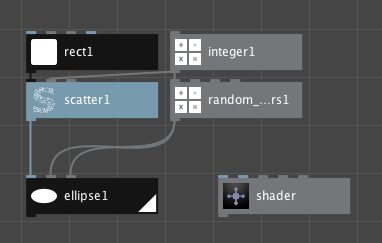
<small>The first part of our network.</small>
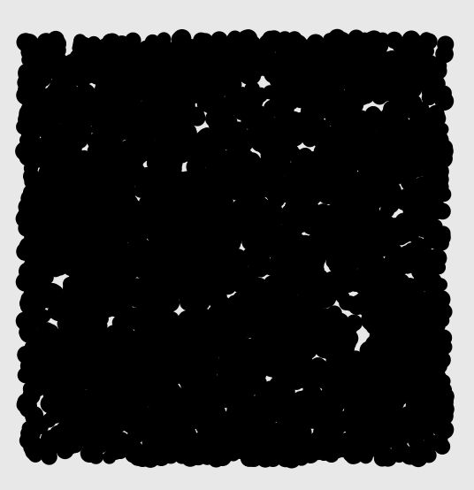
<small>Circles all over the place after creating the first part of our network.</small>

In the second part of our network we're going to calculate the level of shading of each individual ellipse:
- Connect the output of **scatter1** to the **position** port of our **shader** node. You'll notice that the shader node outputs a list of values between 0 and 1.
- Add two [multiply nodes](/node/reference/math/multiply.html).
- Connect the output of **shader** to the **value1** port of **multiply1** and also to the **value1** port of **multiply2**.
- Set the **value2** port of **multiply1** to **0.10**.
- Set the **value2** port of **multiply2** to **0.99**.
- Now add two [add nodes](/node/reference/math/add.html).
- Set the **value2** port of **add1** to **0.08**.
- Set the **value2** port of **add2** to **0.14**.
- Connect the output of **multiply1** to the **value1** port of **add1**.
- Connect the output of **multiply2** to the **value1** port of **add2**.
- Add a [hsb_color node](/node/reference/color/hsb_color.html).
- Connect the output of **add1** to the **hue** port of **hsb_color1**.
- Connect the output of **add2** to the **brightness** port of **hsb_color1**.
- Connect the output of **shader** to the **alpha** port of **hsb_color1**.
- Set both the ports **saturation** and **range** of **hsb_color1** to **1.0**.

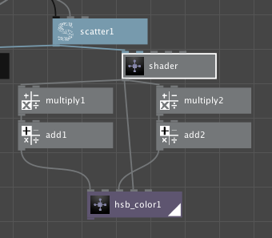
<small>The second part of our network.</small>

Now that we have a list of circles and a list of colors we can the individual pieces together:
- Add a [colorize node](/node/reference/corevector/colorize.html).
- Connect the output of **ellipse1** to the **shape** port of **colorize1**.
- Connect the output of **hsb_color1** to the **fill** port of **colorize1**.
- Add a second [colorize node](/node/reference/corevector/colorize.html).
- Set the **fill** color of **colorize2** to the hex color value **#1a001fff**.
- Connect the output of **rect1** to the **shape** port of **colorize2**.
- Add a [combine node](/node/reference/list/combine.html).
- Connect the output of **colorize2** to the **list1** port of **combine1**.
- Finally, connect the output of **colorize1** to the **list2** port of **combine1**.

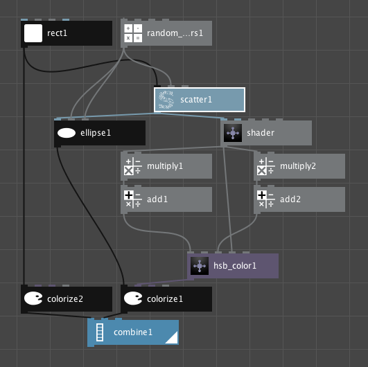
<small>The final network.</small>
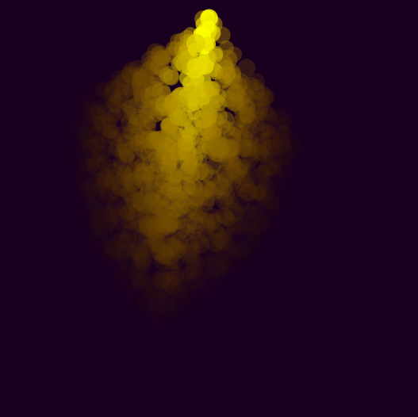
<small>Our final result.</small>

Play around with different shader settings and color variations to vary your results.
