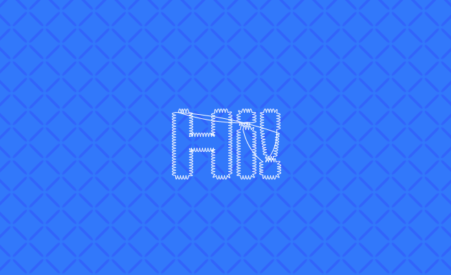
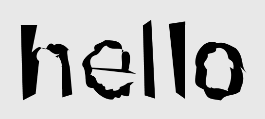
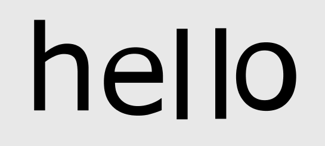
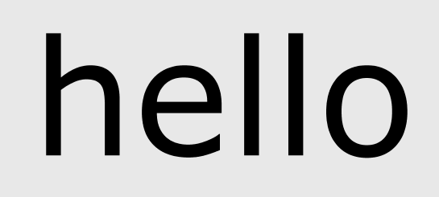
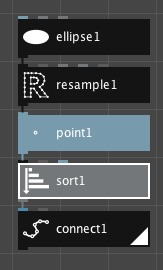

NodeBox works with vector data. Unlike pixels, vector data can be scaled up indefinitely, always resulting in sharp lines:

<small>The viewer at 100%.</small>

<small>The viewer, zoomed in.</small>

Vector data in NodeBox contains the following types of objects:

- **Geometry** is the top level data. All NodeBox nodes take in and return data geometry objects. Even nodes that create a simple path, such as the rect node, still wrap this path in a geometry object.
- Geometry is composed of **paths**. Paths have a **fill and stroke color** and **stroke width**.
- Paths contain **contours**. As an example, the letter "o" is one path composed of two contours: the inner shape and the outer shape. Contours can be **open** or **closed**.
- Contours are made up of  **points** that store the position of the path. A point contains an X, Y coordinate and also a **type**, used for curves.

Scope: Paths, contours and points
---------------------------------
A lot of nodes can operate on paths, contours or points. Here's an example with the wiggle node:

* Create a [textpath node](/node/reference/corevector/textpath.html) and set its **size** to **150.00**.
* Create a [wiggle node](/node/reference/corevector/wiggle.html).
* Connect **textpath1** to **wiggle1**.

Change the **scope** in the wiggle node:

* **Points**: all the points of the textpath move individually.
  
* **Contours**: all contours, or subpaths, move. This includes the *insides* of the letters "e" and "o".
  
* **Paths**: the path moves as a whole.
  

Point numbers
-------------
Points in a path have an ordering defined by their **index**. You can see these indices by turning "Point Numbers" on in the viewer.

Here's a simple example:

* Turn "Point Numbers" on in the Viewer pane.
* Create an [ellipse node](/node/reference/corevector/ellipse.html).
* Create a [resample node](/node/reference/corevector/resample.html). Set the **method** to **By Amount** and the **points** to **20**.
* Create a [point node](/node/reference/corevector/point.html).
* Create a grey [sort node](/node/reference/corevector/sort.html).
* Create a [connect node](/node/reference/corevector/connect.html). Set the **fill** to transparent (alpha value = 0).
* Connect them all together: ellipse1 &rarr; resample1 &rarr; point1 &rarr; sort1 &rarr; connect1.

* Set the connect1 node as rendered. Note that the point numbers go clockwise around the circle, from 0 to 20. 
* In sort1, set the **order** to **By X**. 

The viewer now shows this:

*What happened?* The connect node connects points of the incoming geometry, in order. By changing the *order* of the points (using the sort node), the shape changes. The points no longer follow the circle in a clockwise direction but are sorted by their X coordinates, in other words, points are sorted from left to right.

By playing with different sort orders you can get some interesting results. Try "Distance To Point" and dragging the point handle in the viewer. Changing the ellipse to a text path and see what you can come up with (you might want to increase the text size and the number of points in resample).
