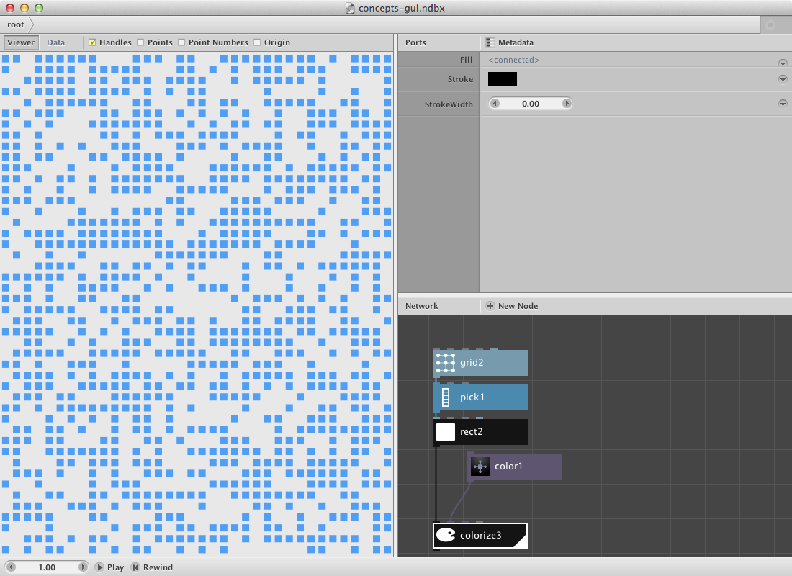
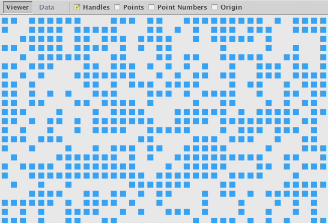
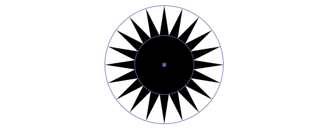
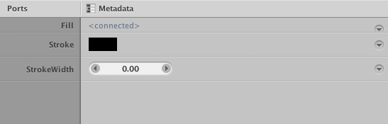
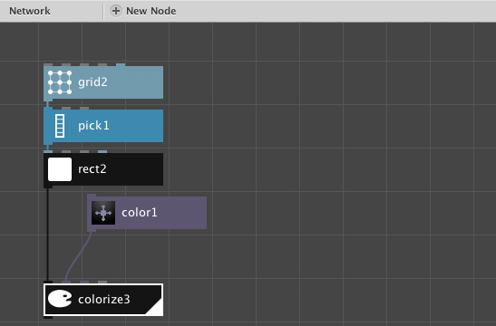
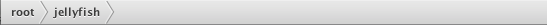
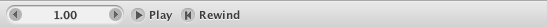

A NodeBox document window consists of these main components:

The Viewer Pane
---------------

The Viewer Pane shows the actual drawing. It also shows handles for the currently selected node. In addition, it can show geometric detail such as the location of the points, their index numbers and the [origin](coordinates.html).

With your mouse in the viewer pane:

- Use the scroll wheel to **zoom** the view in or out.
- Hold the spacebar to **pan** the view.
- Right-click and choose "Reset View" to **reset** the view back to 100% zoom.

Most nodes have **handles**. They allow direct manipulation of the shape, which is generally easier than dragging numbers in the parameter pane. 

<small>Handles for the Star node</small>

The Port Pane
-------------

The port pane allows you to change the port values of the currently selected node. Each node has different ports depending on its function. Ports can have different **types**: numbers, text, colors, menus, etc.

Port values are **draggable**. This means that for each number you can:

- **Double-click the number** to enter a new number. Press enter to confirm.
- **Drag the number** to change it in increments of 1.
- **Drag the number while holding the ALT key** to change it in increments of 0.01 (for small changes).
- **Drag the number while holding the SHIFT key** to change it in increments of 10 (for big changes).
- **Click the arrow keys** to nudge it up or down by 1. Holding ALT and SHIFT nudge by 0.01 and 10, respectively.

Each individual port has a contextual menu:

* **Revert to Default** changes the port value back to its original value.

The Metadata button allows you to [add your own ports to a node](metadata.html).

The Network Pane
----------------

The network pane is where you connect nodes together to make networks.

* To show the **ports** of a node, click the node **once**. This shows the node in the port pane.
* To show the **visual output** of a node, click the node **twice**. This **renders** the node in the viewer.

A powerful feature of NodeBox is that you can change the port values of one node while keeping another node **rendered** in the viewer. This allows you to see the effects of your changes as they propagate through the network. 

You can zoom and pan the network in the same you manipulate the viewer:

- Use the scroll wheel to **zoom** the view in or out.
- Hold the spacebar to **pan** the view.
- Right-click and choose "Reset View" to **reset** the view back to 100% zoom.

You can copy-paste nodes in one document and between documents. Because names in the network are unique, NodeBox will rename nodes as needed.

The difference between the selected and rendered node is explained in the [getting started tutorial](/node/documentation/tutorial/getting-started.html).

The Address Bar
---------------

The address bar is useful when using subnetworks. It allows you to jump back up a level. [Read more about subnetworks](subnetworks.html).

The Animation Bar
-----------------

The animation bar controls the animation features of NodeBox. You can:

- **Drag the frame number** to scrub through the animation.
- **Double-click the frame number** to go to a specific frame.
- **Click play** to start the animation from the current frame.
- **Click rewind** to stop the animation and go back to frame 1.

NodeBox Documents
-----------------
NodeBox manages documents, much in the same way you work on a Photoshop document. Only in NodeBox we just save the nodes, since we can always recalculate the output of the network.

NodeBox documents use the .ndbx extension. These documents can be opened and saved only in NodeBox. To work with other programs, use the import and export functionality.

Importing Graphics
------------------
To import vector data use the [import node](/node/reference/corevector/import.html).

Exporting Graphics
------------------
To export the current image, choose File > Export. The export command doesn't ask for an extension but automatically exports as a PDF file. PDF files retain all vector information and can be manipulated in vector programs such as Adobe Illustrator or Inkscape.

If you have an animation, you can export it in two ways:

- As a sequence of images. Use File > Export Range to export a sequence of images. NodeBox will name them progressively, e.g. myimage-1.png, myimage-2.png, ...
- As a movie. Use File > Export Movie to export a movie using a variety of popular formats. 

