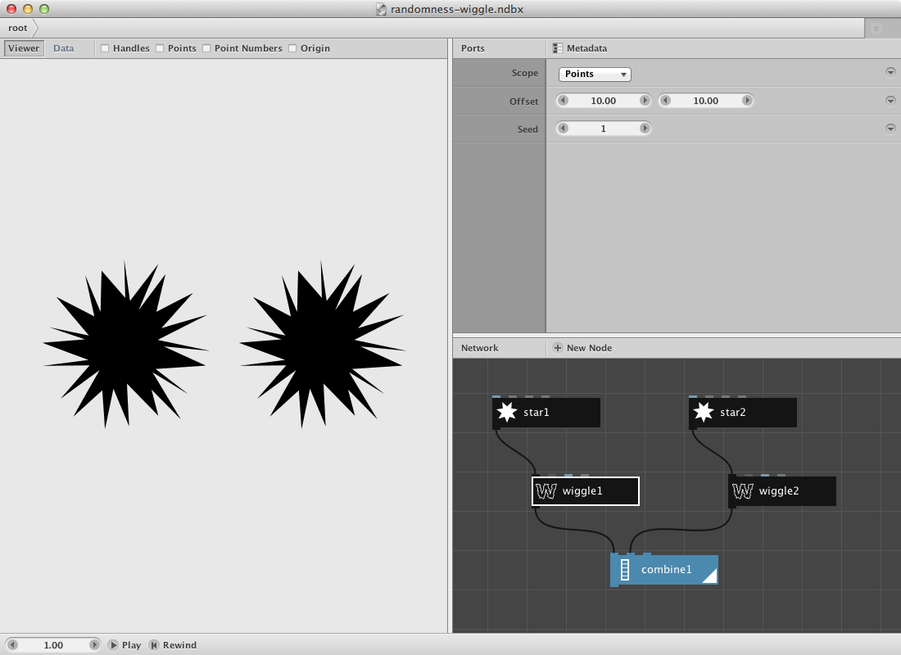
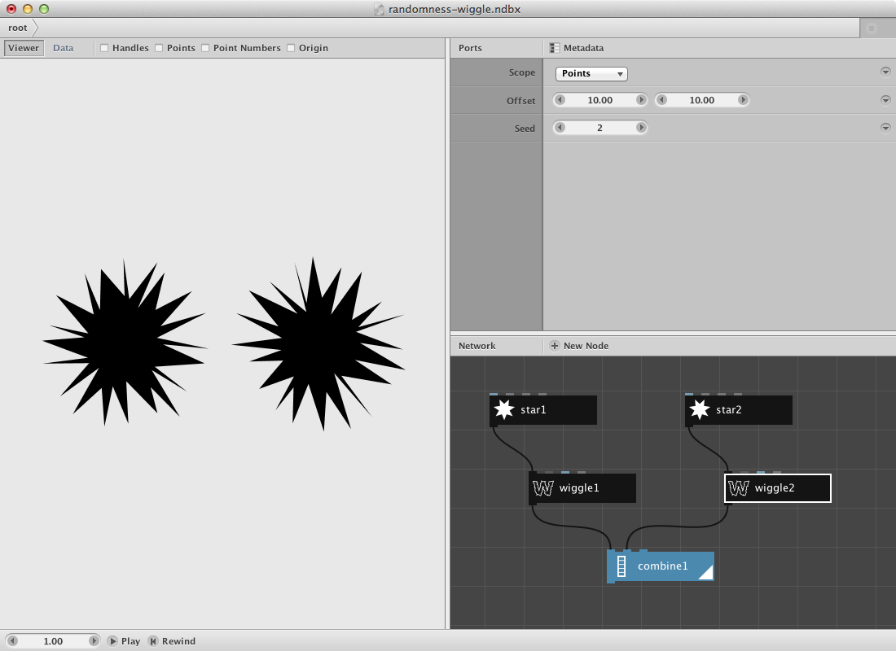

Randomness in NodeBox is not really random. It produces pseudo-random values controlled by an initialization value called the **seed**.

Each seed produces a different range of random numbers. **The same seed will always give the same collection of random numbers.** That's why we talk about *controlled* randomness: within a certain collection, the ordering *appears* random:

* Seed 1: `14 85 77 26 50 45 66 79 10 3`
* Seed 2: `96 95 6 9 84 74 67 31 61 61`
* Seed 3: `24 55 37 61 63 7 2 84 26 24`

This is actually very useful. As a designer, you might pick a certain random variation that you think looks good. It wouldn't make much sense if NodeBox would change the output when you reopen the document. The seed gives us a way of *creating variation without giving up control*.

Everywhere a NodeBox node uses a random value, it provides a seed parameter for you. Nodes such as the [pick node](/node/reference/list/pick.html), [random numbers node](/node/reference/math/random_numbers.html) and [wiggle node](/node/reference/corevector/wiggle.html) will always produce the same result for the same seed.

Here's an example:

* Create a [star node](/node/reference/corevector/star.html). Set **position** to **-120.00, 0.00** to move it to the left.
* Create a [wiggle](/node/reference/corevector/wiggle.html) node. Set **seed** to **1**.
* Connect the output of **star1** to the **shape** port of **wiggle1**.
* Select the two nodes, copy them, and paste them again. 
* **Double-click wiggle2** to make it rendered.
* In **star2**, change **position** to **120.00, 0.00** to move it to the right.
* Create a [combine](/node/reference/list/combine.html) node.
* Connect the output of **wiggle1** to the **list1** port of **combine1**.
* Connect the output of **wiggle2** to the **list2** port of **combine1**.

If you look at the output of the combine node, you'll see that they both have the same random variation. That's because they share the same random seed.

In **wiggle2**, change the **seed** to 2. Note that the two stars now look different.

**The actual number of the seed is unimportant.** Seed 10 is not "more random" than seed 1. See it as the index number of a certain variation.