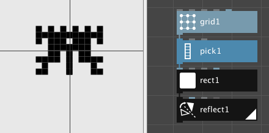
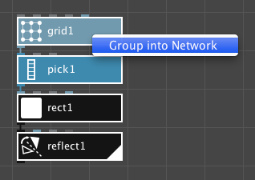
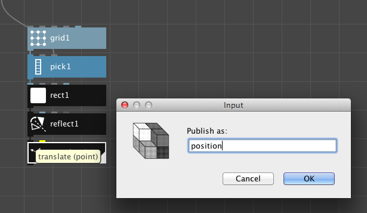
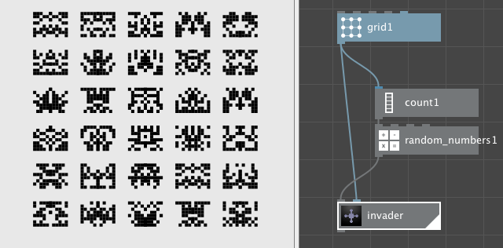
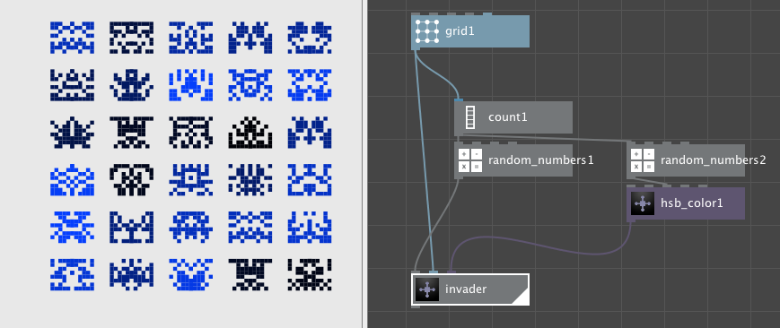

NodeBox networks can become really big. After a while, it becomes harder and harder to find the node you're looking for. To solve this, NodeBox can group related nodes into a network. This works just like on your computer, where you can group related files in a directory on your hard disk.

NodeBox networks can act as an **organizational** tool, keeping big networks tidy. By grouping a block of nodes into a network, you can box up and name a group of functionality. For example, when working on a data visualisation project, the header and explanatory text  could go in a subnetwork "captions".

NodeBox networks can also act as **custom nodes**, much in the same way as the built-in nodes. 

Root vs. subnetworks
===================
Like directories on your hard drive, **NodeBox files are organized as a tree**. At the root, or base, of this tree is the *root node*. Below that are *subnetworks*. These can nest arbitrarily deep. For example, a network for an animated character could look like this:

<ul>
  <li>Root</li>
  <ul>
    <li>character</li>
    <ul>
      <li>head</li>
      <li>body</li>
      <li>left_arm</li>
      <li>right_arm</li>
      <li>left_leg</li>
      <li>right_leg</li>
    </ul>
  </ul>
</ul>

* To go **down into** a network, right-click the node and select **Edit Children**.
* To jump **back up** to a higher level. Click the segment in the **address bar** at the top of the NodeBox window:
  

Node Invaders
=============
As an example of a custom node we're going to create the classic "space invaders" character using NodeBox.

<small>Classic Space Invaders</small>

We follow a typical process:

* First, design one character in the root network.
* Group all nodes related to the character in a network and give it a name.
* Publish relevant ports in the network.
* Test the sub-network.
* Connect the inputs of the sub-network.

Design the character
--------------------
The space invader character is a symmetrical grid of 11 x 8 points.

We're going to create one half of the space invader, then [reflect](/node/reference/corevector/reflect.html) it across the X axis.

* Create a [grid node](/node/reference/corevector/grid.html).
* Set **rows** to **8**, **columns** to **6**, **width** to **50.00** and **height** to **70.00**. Set the **position** to **25.00,0.00**. This will be the *template* for our grid.
* If we would put rectangles on all these points we'd just get a full block. Instead we're going to **pick** some random points to work with.
* Create a [pick node](/node/reference/list/pick.html) and set **amount** to **25**.
* Connect the output of **grid1** to the **list** port of **pick1**.
* Create a [rect node](/node/reference/corevector/rect.html) and set **width** and **height** to **10.00**.
* Connect the output of **pick1** to the **position** port of **rect1**.
* Finally, let's mirror the character. Create a [reflect node](/node/reference/corevector/reflect.html) and set **angle** to **90.00**.
* Connect the output of **rect1** to the **shape** port of **reflect1**.

You can create different variations of the invader by changing the **seed** value of **pick1**.

Group into network
-------------------
We've just created one space invader character. To be able make more of them, we will group the invader nodes into their own network, much like the built-in nodes of NodeBox.

* Select all nodes (grid1, pick1, rect1, reflect1) by dragging over them.
* Right-click one of them and choose "group into network":

This will leave you with one node, subnet1. Don't worry, all your nodes are contained in this network as *child nodes*.
Right-click subnet1, choose **Rename**, and type **invader**.

Publish relevant ports
----------------------
Note that the invader node doesn't take any inputs. We can't change the seed like we did before, for example. Also, we can't change its position. To make ports available to the upper level, we *publish* them.

* Right click the **invader** node and choose "Edit Children".
* We see all our nodes back. Note that in the top part of the window, it says "root > invader". This means we're in the invader sub-network.
* Hover over the **seed** port of the **pick1** node. Right-click and choose "Publish". Accept the default name.
* To be able to move the invader, we need to add an extra node at the end. Create a [translate node](/node/reference/corevector/translate.html) below the reflect1 node.
* Connect the output of **reflect1** to the **shape** port of **translate1**. 
* Right-click the **translate** port of **translate1** and choose "Publish". Name the published port "position".
  
* Make sure **translate1** is rendered by double-clicking it. We've now created our full character.

Test the subnetwork
-------------------
Before we connect any grids or values to the invader, it's a good idea to check if all published ports do what we expect.

* Go back to the root level by clicking "root" in the address bar at the top of the document window. You should see our one "invader" node again.
* Change the **seed** value of the invader node. Each seed should give us a different character.
* Change the **position** of the invader node. The invader moves accross the canvas.

Why do I ask you to test sub-networks first? When creating this example, I published the position port of the grid, thinking that this would work. However, since the invader is mirrored, this gave all kinds of weird effects, which were very hard to debug when looking at a whole grid of them. By testing one invader, in isolation, first we can make sure that the correct input gives us the correct output.

Connect the inputs of the subnetwork
------------------------------------
Everything seems fine, so it's time to create a horde of space invaders. 

* Create a **grid** node and place it above **invader**.
* Set the **rows** to **6** and **columns** to **5**. Set the **width** and **height** to **600.0**.
* Connect the output of **grid1** to the **position** port of **invader**.
* Render the **invader** node by double-clicking it. We should see a grid with all the same invaders.
* For the seed value, we'll generate some random numers. We need as many as there are points in the grid, so we'll use a count node to see how many points we get back.
* Create a [count node](/node/reference/list/count.html). Connect the output of **grid1** to the **list** port of **count1**.
* Create a [random numbers node](/node/reference/math/random_numbers.html). Connect the output of **count1** to the **amount** port of **random_numbers1**.
* Finally, connect the output of **random_numbers1** to the **seed** port of our **invader** node.

<small>A daunting horde of space invaders</small>

At this point, our invader node works **just like any other node in NodeBox**. This is an important concept: custom nodes don't behave differently from built-in nodes and can do exactly the same things.

Explore and extend
------------------
Now that we've created our base invader character, we can add features to it to make it more appealing. As an example, we'll give them all a different fill color:

* In the invader subnetwork, create a [colorize node](/node/reference/corevector/colorize.html).
* Connect the output of **translate1** to the **shape** port of **colorize1**. 
* Set **colorize1** rendered.
* Publish its **fill** port.
* In the root network, create a [HSB color node](/node/reference/color/hsb_color.html). Set the **saturation** to **255.00**. 
* Copy/paste the existing **random_numbers1** node. This creates a **random_numbers2** node. Note that its input is still connected to the **count1** node.
* Connect the output of **random_numbers2** to the **brightness** port of **hsb_color1**.
* Connect the output of **hsb_color1** to the **fill** port of our **invader** node.

Good practices
==============
When designing subnetworks for yourself, or for other people, it makes sense to follow a set of common guidelines. Creating a subnetwork is much like designing the GUI for an application: in the end, you decide which buttons and sliders are available, but users will expect some level of consistency.

* Always provide a **position port** for networks that generate new geometry (like the invaders node). A simple solution is to add a [translate node](/node/reference/corevector/translate.html) at the end of your subnetwork, like we've done here.
* If you also want to provide a **width and height**, use a [fit node](/node/reference/corevector/fit.html) instead of a translate node.
* **Test** the subnetwork first without connecting anything to it. If a single copy of e.g. an invader subnetwork works, it is likely a grid of them will work as well. Contrary, if moving the position of a single invader doesn't do what you want, fix that first before making a grid out of them.
* When appropriate, **make your network look like a built-in node**. For example, nodes that generate new geometry should provide a way to set the position and the size. Check if your node resembles a built-in node and mimick the way it works. Check the [node reference](/node/reference/) for an overview of all built-in nodes.

