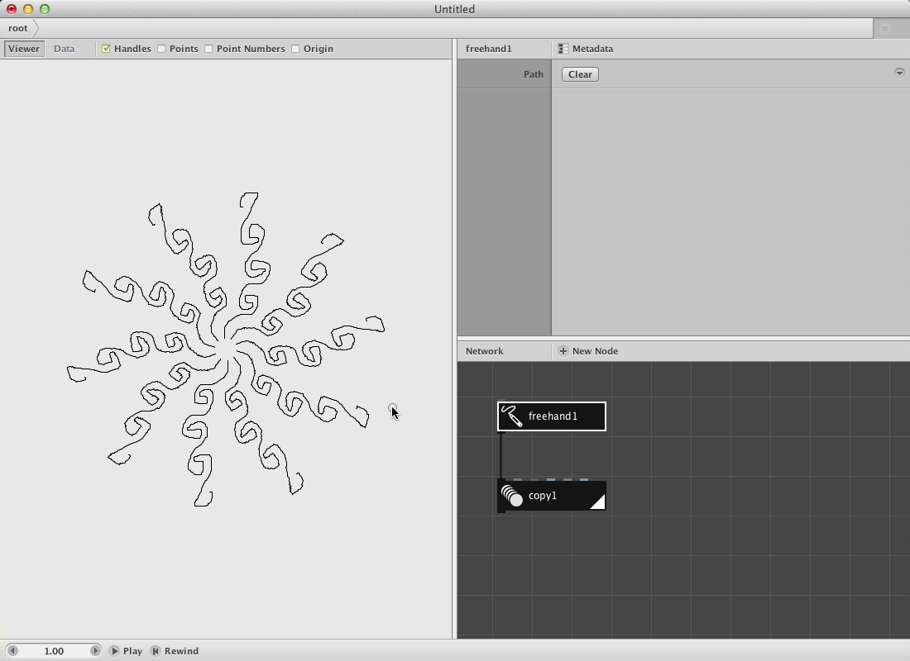
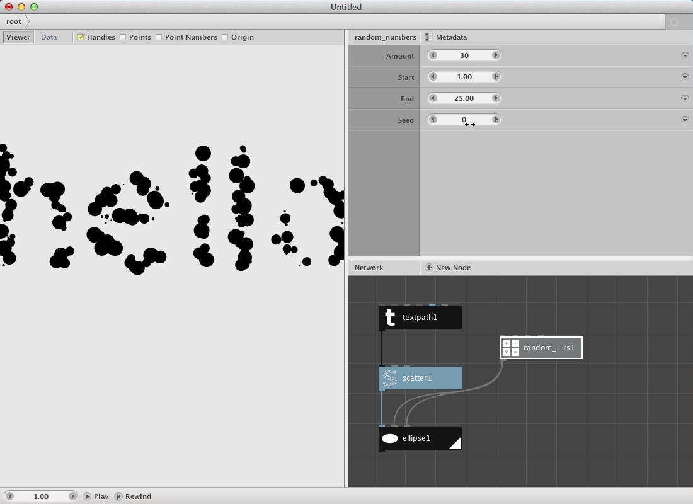
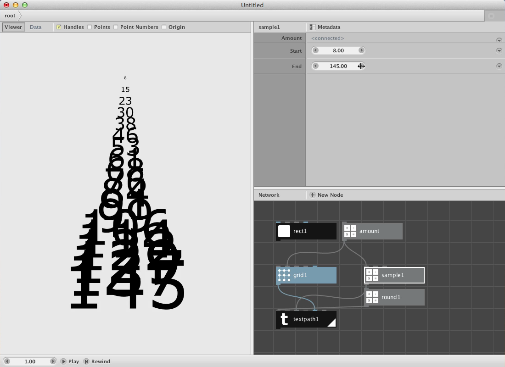

If you're brand new to NodeBox, start by reading the beginner tutorials:

<ul id="bootcamp">
  <li class="three columns">
    <a href="tutorial/getting-started.html">
      
      Getting Started
    </a>
  </li>
  <li class="three columns">
    <a href="tutorial/exploring.html">
      
      Exploring
    </a>
  </li>
  <li class="three columns">
    <a href="tutorial/animation.html">
      
      Basic Animation
    </a>
  </li>
</ul>

Screencasts
-----------

  

    <a class="fancybox fancybox.iframe" href="http://player.vimeo.com/video/54519434?badge=0">101: Introduction</a>
  

  

    <a class="fancybox fancybox.iframe" href="http://player.vimeo.com/video/54523012?badge=0">102: Lists</a>
  

  

    <a class="fancybox fancybox.iframe" href="http://player.vimeo.com/video/54523585?badge=0">103: Types</a>
  

Reference
---------

* [All Nodes by Category](/node/reference)

Getting Involved
----------------
* Questions or Comments? Visit the [NodeBox forums](http://support.nodebox.net/discussions).
* Found a bug? Add it to our [GitHub issues page](https://github.com/nodebox/nodebox/issues?state=open).
* Something else? E-mail questions at <support@nodebox.net>.

