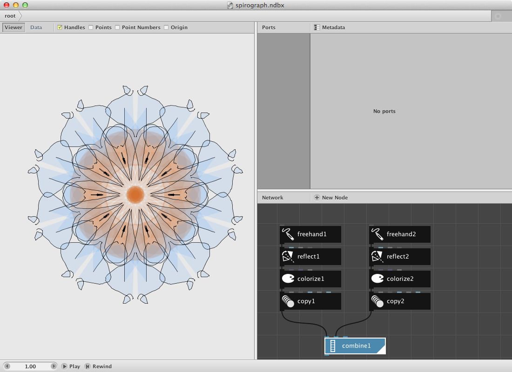
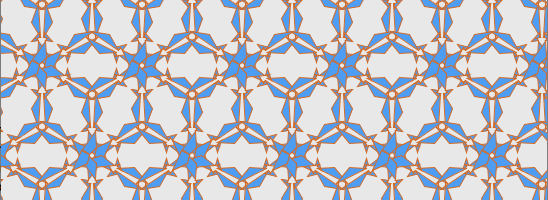

TODO
====
* Update screenshots into steps
* Less examples

Spirograph Example
-------------------

Let's make a drawing based on the [Spirograph](http://en.wikipedia.org/wiki/Spirograph) principle. 

In short: we will **create a shape** and **copy it** a few times on top of each other with a difference in rotation.

Create a [Freehand node](/node/reference/freehand.html) and draw a small line in order to have a reference for the rest of the procedure. You can **draw by clicking and dragging the mouse** in the viewer pane.

Create a [Reflect node](/node/reference/reflect.html) node and send the output of freehand1 to it. Watch out: there are two reflect nodes, we need the one with a black icon.

* Change the **Angle** parameter to **90.00**. You should see the change in location of the reflected shape.
* Change the **X** parameter to **0.0**. Dito.

Create a [Copy node](/node/reference/copy.html) node and send the output of reflect1 to it.

* Change the **Copies** parameter to **10**.
* Change the **Rotate** parameter to **36.0**. The calculation of the rotation angle is based on the equation 360.0 / number of copies.

Render copy1 and click once on freehand1. Start drawing anything and see the spirograph appear. **Not pleased with the result?** You can **start over** and empty the path by selecting all numbers in the path parameter then press backspace and the return key.

**Try out:**

* Different settings for the parameters in copy1 to create more or less complex spirograph drawings.
* Insert a [Colorise node](/node/reference/colorise.html) node between the freehand1 and reflect1 to experiment with colors.  
* Copy the four nodes, make a few variations and group them by sending all of them to a [Combine node](/node/reference/combine.html) node.

A pattern example.
-------------------

Creating patterns is fairly easy in NodeBox 3.

Lets create an example:

Create two [Polygon nodes](/node/reference/polygon.html) node.

* Set **Radius** for both of them to **20.00**.
* Set **Sides** to respectively **5** and **3** creating a pentagon and a triangle.
* Toggle on the **Align** parameter for both polygons.

The idea is to create a pattern which can be easily changed by using a seed parameter.

Create two [Wiggle nodes](/node/reference/wiggle.html) and connect polygon1 to wiggle1 and polygon2 to wiggle2.

* Set **Offset** to **30** for the wiggle node handling the pentagon.
* Set **Offset** to **10** for the other one.
* Set **Seed** respectively **0** and **1**

We will generated a new shape based on the two shapes by using a binary opereration.

Create a [Compound node](/node/reference/compound.html) and send wiggle1 to shape1 input and wiggle2 to shape2 input.

* Set **Function** to **Difference**.

A key node for building networks that create patterns is the [Align node](/node/reference/align.html). It allows you to change the centerpoint of a geometry. The base for these operations on the vertical and horizontal axes is the origin which you can toggle on/off in the viewer pane. 

Create one and send compound1 to it.

* Set **HAlign** to **Left**.
* Set **VAlign** to **Bottom**.

Now create a (black) [Reflect node](/node/reference/reflect.html) to make a reflection of the shape.

* Set **Angle** to **90**
* Turn on the **Keep Original** option

Create a [Copy node](/node/reference/copy.html) to create a few copies. Connect reflect1 to it.

* Set **Copies** to **6**.
* Set **Rotate** to **60.00**.

The result should look like this:

Add a [Colorise node](/node/reference/colorise.html) to give the shape a color.

Now we will create a [Grid node](/node/reference/grid.html) to multiply the pattern on a horizontal axe. 

* Set **Rows** to **1**.
* Set **Columns** to **10**.

Now add a [Translate node](/node/reference/translate.html) to the network and send the pattern (copy1) to the shape port and grid1 to the (blue) translate port.

Finally add an other Copy node and send translate1 to it.

* Set **Copies** to **10**
* Set **Translate** to **-50** and **90**

Rendering the copy2 node should return this result:

**Try out:**

* Change the **Seed** parameter in one or both of the wiggle nodes to change the pattern:

