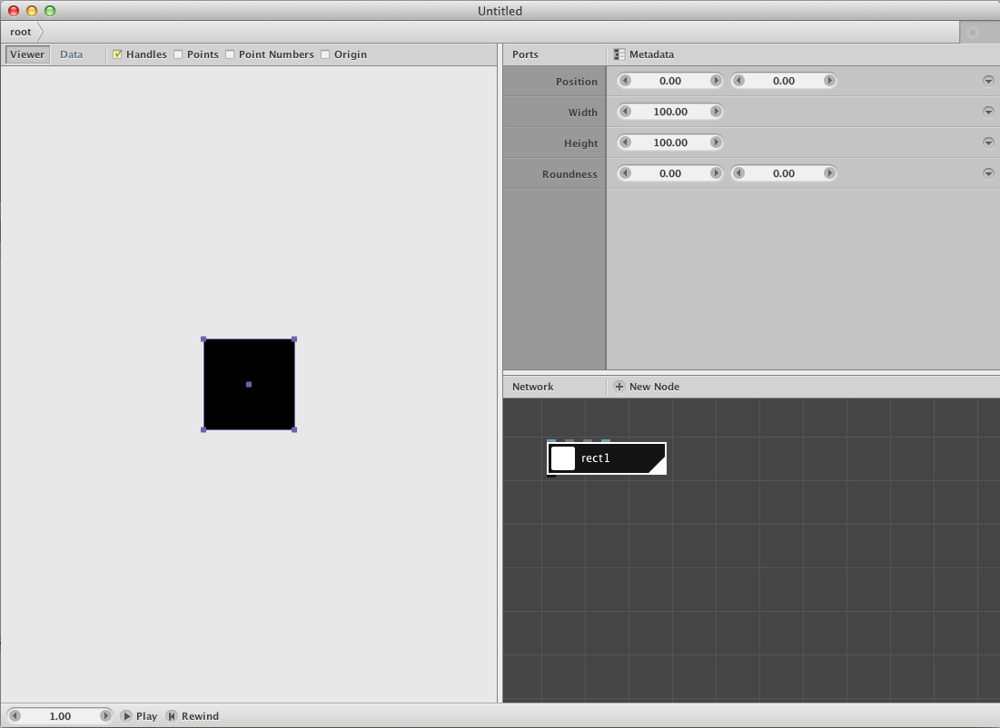
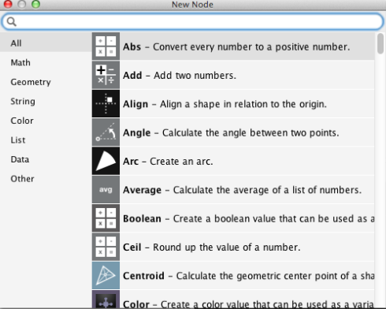
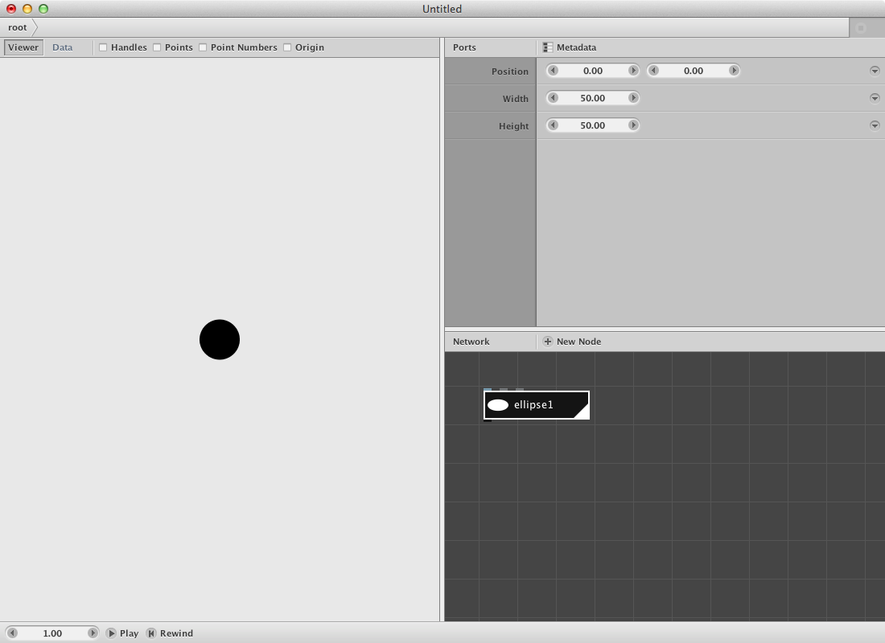
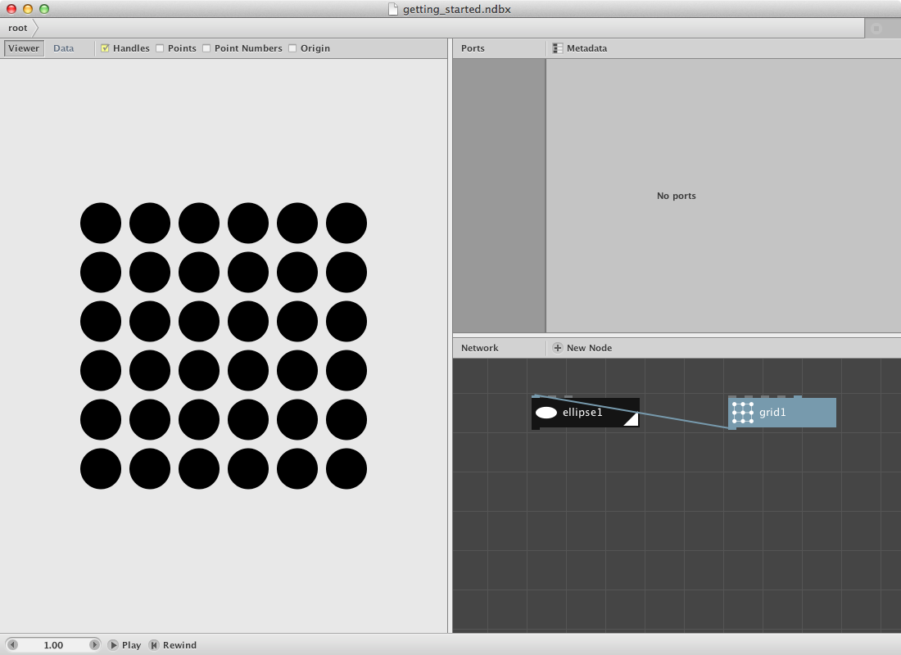
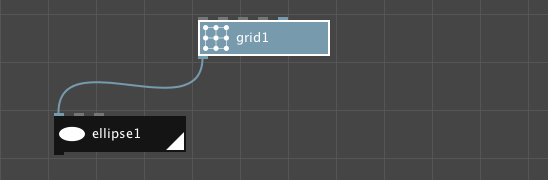
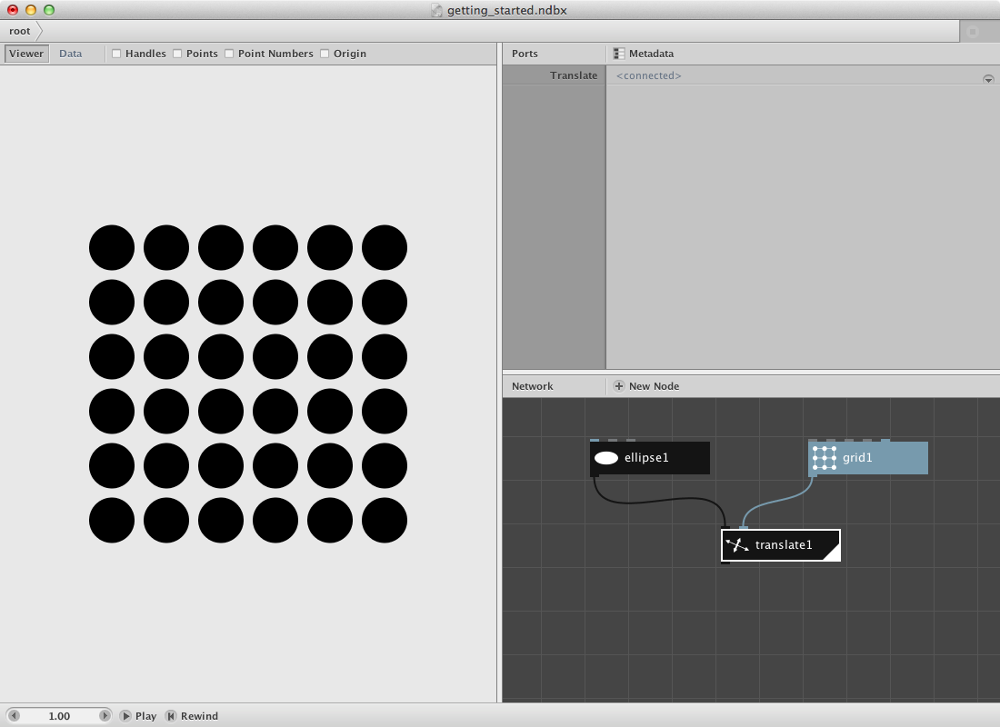
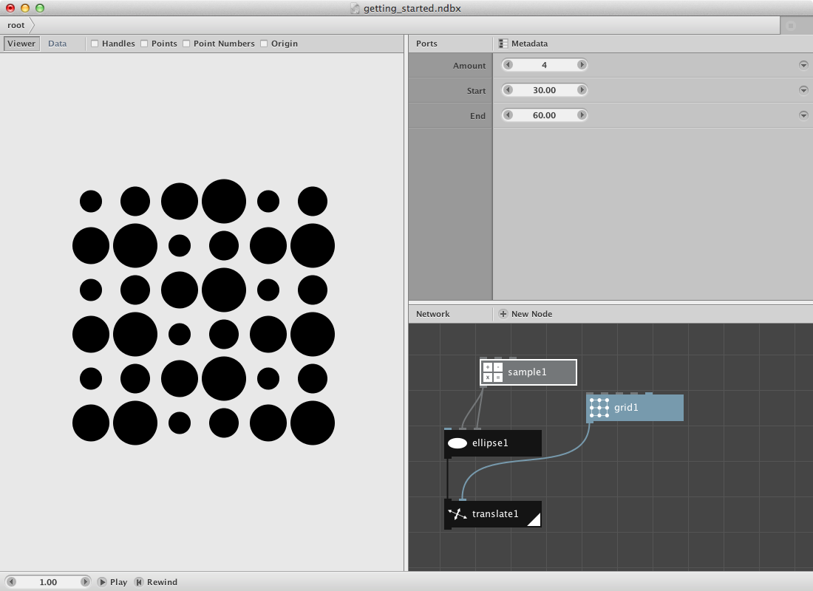
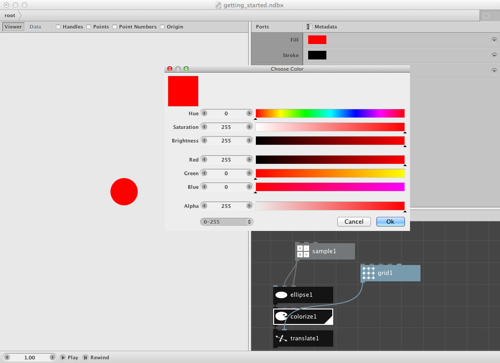
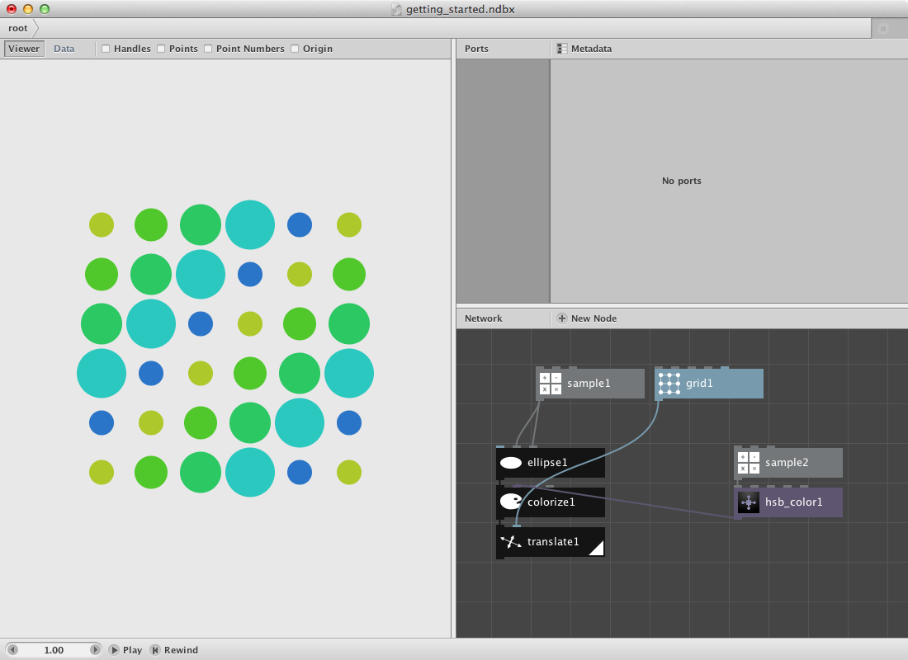
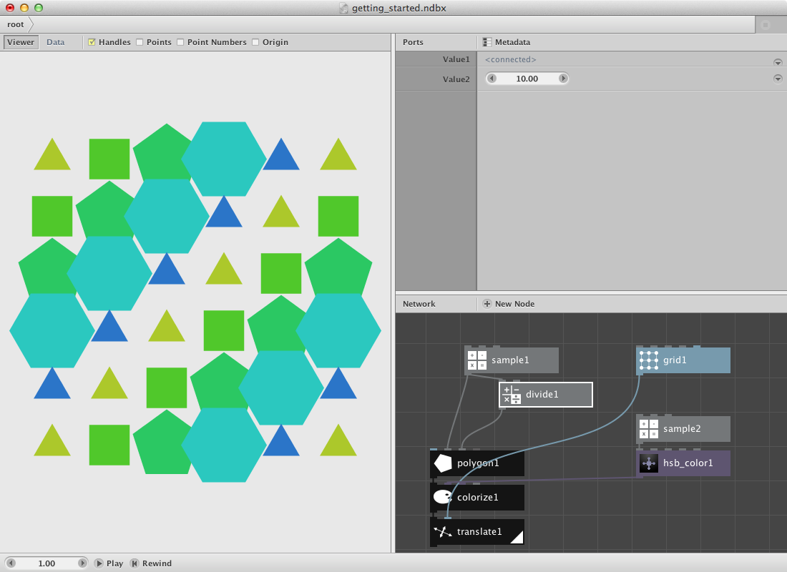

Welcome to NodeBox! In this tutorial we're going to learn the essentials for working with the program.

Downloading NodeBox
-------------------
If you haven't done so already, you should [download](/download/) NodeBox first.

To install on Windows, double-click the installer and walk through the steps. On Mac OS X, drag the icon to your Applications folders (or anywhere you like).

Creating your first node
------------------------
Open the application. After a short loading time, NodeBox opens a new document window that looks like this:

NodeBox documents are composed of **networks of connected nodes**.

Remove the default [rect node](/node/reference/corevector/rect.html) by selecting it and by entering the backspace button.

Click the **New Node** button or double-click anywhere in the network pane. This brings up the node selection dialog:

From this window you can create an [ellipse node](/node/reference/corevector/ellipse.html). There are three possible ways:

* Scroll through the (sorted) list until you find the Ellipse node, then double-click it.
* Click on the Geometry Tab and scroll through the list until you find the Ellipse node, then double-click it.
* Enter the first letters ("el") and press enter when the Ellipse node is selected. If there is more than one node, use the up and down arrow keys to select the node you want.

The NodeBox document window consists of three panes. These are (clockwise, from the top):

* **The Viewer Pane**, showing the composition you're working on.
* **The Parameter Pane**, allowing you to adjust the parameter values of a node.
* **The Network Pane**, showing all nodes and their connections.

NodeBox named the new node "ellipse1". That's because each node in NodeBox needs to be uniquely identifiable.

Let's change some parameters:

* Double-click the **width** field (where it says "100"), type **50**, and press enter. The ellipse should now have a width of 50.
* Do the same thing for the **height** field.

Your screen should look like this:

Everywhere you see a number, you can drag it to see what it does. If you make a mistake, you can undo it (Cmd+Z on Mac or Ctrl+Z on Windows/Linux).

Connecting nodes
----------------
The power of NodeBox comes from connecting nodes together. Nodes are connected using their ports. Each node has one output port and zero or more input ports. In this simple example, we're going to put shapes on the points of a grid.

Click the **New Node** button again, and choose the [grid node](/node/reference/corevector/grid.html). Double-click it to place it in the network.

* Set **rows** to **6**.
* Set **columns** to **6**

Instead of an ellipse, you should now see a grid of little blue dots in the viewer pane. We can connect the **grid1** and **ellipse1** nodes by dragging from the output port of the **grid1** node to the **position** input port of the ellipse1 node. Double-click the **ellipse1** node and you will see this output:

Rendered and Selected Node
--------------------------
NodeBox can only show the output of **one node at a time**. We see the output of this **rendered node** in the viewer pane. Currently, ellipse1 is the rendered node, this is indicated by the little white triangle in the right corner of the node.

We can view at the results of one node while working on the parameters of another one. We'll keep the ellipse1 node rendered while **selecting** the grid1 node (click on it once).

* Change the number of **rows** and **columns** and see what happens.

We've just updated the grid1 node, but we're still looking at the results of the ellipse1 node. This means the changed output of grid1 is passed on to serve as the input of ellipse1. This is the core idea behind NodeBox: *nodes passing (in this case) visual geometry or other information to other nodes*.

To recap:

* In the viewer, we look at the **rendered node**. In the network pane, the rendered node has a white triangle at the right bottom of the node. To change the rendered node, **double-click** a different node.
* In the parameter pane, we look at the **selected node**. In the network pane, the selected node has a white stroke around it. To change the selected node, **click** a node once.

Variety
-------------
Instead of connecting the grid node directly to the ellipse node, another possibility is to create a [translate node](/node/reference/corevector/translate.html) and connect the output of **ellipse1** to the **shape** port of **translate1** and the output of **grid1** to the **translate** port of **translate1**.

For the moment we're drawing the same ellipse on each point of the grid1 node so let's create some variation in size and color. 

Suppose we want 4 different sizes for the ellipse and 5 different colors. 

Click the **New Node** button again, and choose the [sample node](/node/reference/math/sample.html). (You can also double-click in the network view to open the node selection dialog). Double-click it to place it in the network.

* Set **amount** to **4**
* Set **start** to **30.0**
* Set **end** to **60.0**

If you now take a look at the viewer pane, you should see a list of 4 values (30.0, 40.0, 50.0 and 60.0), listed vertically. Now connect the output of **sample1** both to the **width** port and to the **height** port of the **ellipse1** node.

Leave all other nodes as before and double-click the **translate1** node. Take a look at the result:

What happened is that the first ellipse gets a size of 30.0, the second one a size of 40.0, the third a size of 50.0 and the forth a size of 60.0. Since there are only 4 (size) options but a lot more points in the grid it will loop again over the same (size) list so the fifth ellipse gets a size of 30.0, the sixth a size of 40.0 and so on. 

Have a look at the [Nodebox Concepts page](/node/documentation/concepts/concepts.html) for more detailed information on this principle.

Now let's add color to the network.

Click the **New Node** button again, and choose the [colorize node](/node/reference/corevector/colorize.html). Double-click it to place it inside the network and position it between the ellipse1 node and the translate1 node. You don't have to remove connections, just connect the output of **ellipse1** to the **shape** port of **colorize1** node and the output of **colorize1** to the **shape** port of **translate1**. Nodebox will remove the previous connection.

Double-click the colorize1 node and click on the **fill** parameter: a color picker window will appear.

Choose a color and render the translate1 node. As a result all ellipses will have the same color.

Now let's create 5 different colors. 

Create a [hsb color node](/node/reference/color/hsb_color.html) and 

* Set **saturation** to **200.0**
* Set **brightness** to **200.0**

In order to create a number of colors we will change the value of **hue** a number of times.

Create an other [sample node](/node/reference/math/sample.html) and 

* Set **amount** to **5**
* Set **start** to **50.0**
* Set **end** to **150.0**

Now connect the output of this **sample2** node to the **hue** port of the **hsb_color1** node. This will create 5 colors within the range of green and blue. Finally connect the output of **hsb_color1** to the **fill** port of **colorize1**. Render the **translate1** node again and have a look at the result:

Until now we have worked with the same ellipse shape. NodeBox allows you to work with a variety of shapes. Let's replace the ellipse1 node with a [polygon node](/node/reference/corevector/polygon.html).

Create one and:

* Connect the output of **sample1** to the **radius** port of **polygon1**.
* Check the **align** checkbox of **polygon1**.
* Create a [divide node](/node/reference/math/divide.html) and connect the output of **sample1** to its **value1** port. 
* Change *value2** of **divide1** to **10.0**.
* Connect the output of **divide1** to the **sides** port of the **polygon1** node.
* Change the **width** and **height** parameter of **grid1** to **400.0** to make more space between the different elements.
* Connect the output of **polygon1** to the **shape** port of **colorize1**. The **ellipse1** node can be discarded from this point.
* Double-click **translate1** again to render everything.

You should get this result:

Saving and Exporting
--------------------
NodeBox saves documents in the .ndbx file format. These files can only be opened by NodeBox. If you want to use NodeBox compositions in other programs, **export** the document to PDF. You can use PDF files in other graphic programs such as Adobe Photoshop or Illustrator. NodeBox preserves all vector information so your compositions won't be pixellated.

Export the document:

* Choose "Export..." from the File menu
* Choose the file format you want to export to (PDF).
* Navigate to the Desktop.
* Export as "test.pdf" (without the quotes).
  (The first time might take a while). 
* Open this file by going to the desktop and double-clicking it. Zoom in to verify that all lines are still smooth.

NodeBox will export the rendered node. In our example, if we just wanted to export one polygon, we need to double-click the polygon1 node to rendere it, then export again.

Next Steps
----------
Now that you've seen the basics, you can:

* [Explore Further](exploring.html): Build and explore interesting examples of basic nodes and how to use them together.
* [Animate](animation.html): See the basics of animation.
* [Learn the GUI](../concepts/gui.html): Discover all functionality of the NodeBox GUI.

