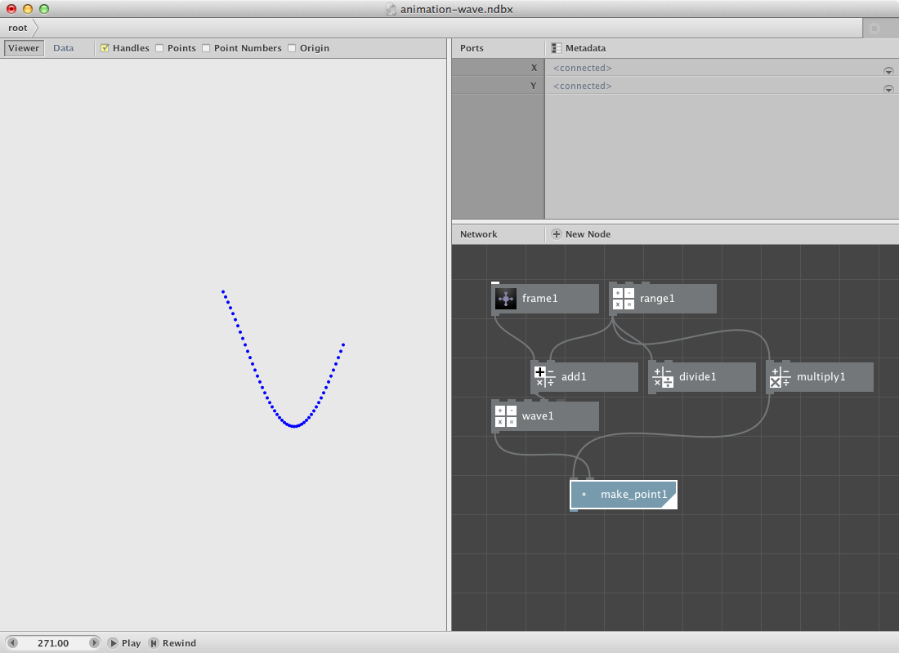
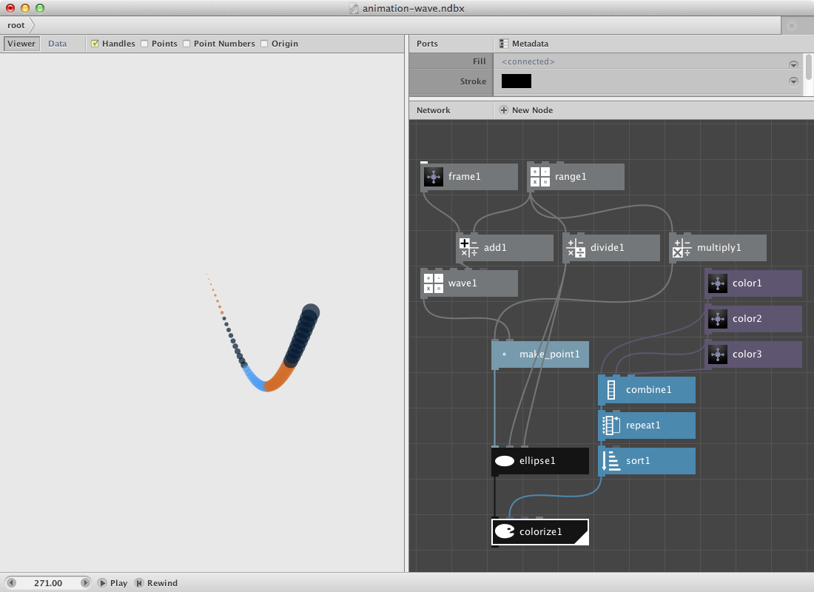
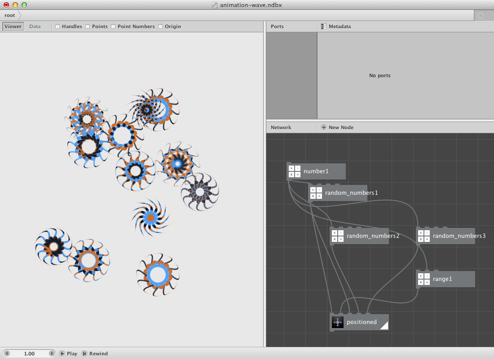

You should already have read the [tutorial on basic animation](/node/documentation/tutorial/animation.html). This pages goes into more detail and shows tricks and techniques.

Conceptually, NodeBox animation is very easy to understand. Every frame, NodeBox sets the value of FRAME to the current frame number. By referring to it over a frame node, you can create animations.

Let's start with a simple wave animation.

* Create a wave node. Set **Min** to **-100**, **Max** to **100.0** and **Speed** to **80.0**. We will address the frame a number of times.
* Create a frame node.
* Create a range node. Set **End** to **50.0**.
* Create an add node. Connect frame1 to **Value1** and range1 to **Value2**.
* Connect add1 to **Frame** of wave1.

We will divide and multiply the range for later usage. We will also create points based on the previous nodes.

* Create a divide node, connect range1 to **Value1** and set **Value2** to **2.0**. 
* Create a multiply node, connect range1 to **Value1** and set **Value2** to **3.0**.
* Create a make point node. Send wave1 to **Y** and multiply1 to **X**.

Now we will add some coloured shape to each of these points.

* Create an ellipse node. Connect make_point1 to **Position** and divide1 to **Width** and **Height**.
* Create three color nodes and pick colors.
* Create a combine node and send each of the color nodes to it.
* Create a repeat node and connect combine1 it. Set **Amount** to **10**. The idea is to have a possibility to change the number of times each color appears.
* Create a sort node and connect repeat1 to it. Set **Key** to **Hue**.
* Create a colorize node. Connect ellipse1 to **Shape** and sort1 to **Fill**.
* Render colorize1.

Test the animation by pressing the **Play** button in the animation bar.

<object classid="clsid:02BF25D5-8C17-4B23-BC80-D3488ABDDC6B" width="580"
        height="480" codebase="http://www.apple.com/qtactivex/qtplugin.cab">
        <param name="src" value="animation-snake.m4v" />
        <param name="autoplay" value="true" />
        <param name="controller" value="true" />
        <param name="loop" value="true" />
        <embed src="animation-snake.m4v" width="580" height="480" autoplay="true" 
        controller="true" loop="true" pluginspage="http://www.apple.com/quicktime/download/">
        </embed>
</object>

Notice that the alignment of the shape is at the right of the centerpoint. We will add a few nodes to changes this.

* Create a group node. Since colorize1 has multiple paths (for each ellipse one) we need to group it into 1 geometry object to be able to align it as a whole. Connect colorize1 to it.
* Create an align node. Connect group1 to **Shape**. Set **Halign** to **Right** and **Valign** to **Middle**.
* Create a copy node. Connect align1 to **Shape**. Set **Copies** to **12** and **Rotate** to **30**.
* Press play again.

<object classid="clsid:02BF25D5-8C17-4B23-BC80-D3488ABDDC6B" width="580"
        height="480" codebase="http://www.apple.com/qtactivex/qtplugin.cab">
        <param name="src" value="animation-wave.m4v" />
        <param name="autoplay" value="true" />
        <param name="controller" value="true" />
        <param name="loop" value="true" />
        <embed src="animation-wave.m4v" width="580" height="480" autoplay="true" 
        controller="true" loop="true" pluginspage="http://www.apple.com/quicktime/download/">
        </embed>
</object>

We will create a subnetwork of this as a next step. 
Go to the [subnetworks page](../concepts/subnetworks.html) and read this it it doesnt' ring a bell..

* Select all nodes. Right-click them and **Group into network**.
* Right-click it again and rename it **thing**.
* Right-click it a last time and **Edit Children**.
* Create a scale node and connect copy1 to **Shape**.
* Create a translate node and connect scale1 to **Shape**.
* Publish **Position** of translate1 call it translate.
* Publish **Amount** of repeat1 and call it coloramount.
* Publish **Speed** of wave1 and call it wavespeed.
* Render translate1 and go back to the root.

Now we have an object which we can translate and alter by sending different values to speed and coloramount. Suppose we want this thing to go downwards.

* Create a frame node.
* Create an add node. Connect frame1 to **Value1**. We will publish **Value2** to have an initial y startposition.
* Create a mod node and connect add1 to **Value1**.
* Create a make point node. Connect mod1 to **Y**. Connect this make_point1 to **Translate** of thing.
* Create two random numbers node. Set **Amount** for both to **1**. 
* Set **Start** to **1.0** and **End** to **15.0** of random_numbers1. Connect it with **Amountcolor** of thing.
* Set **Start** to **40.0** and **End** to **150.0** of random_numbers2. Connect it with **Wavespeed** of thing.

Let's turn this into a new network.

* Select all nodes. Right-click them and **Group into network**.
* Right-click it again and rename it **positioned**.
* Right-click it a last time and **Edit Children**.
* Publish **X** of make_point1. Call it **X**.
* Publish **Value2** of add1. Call it **Y**.
* Publish **Seed** of random_numbers1 and call it **Seedcolor**.
* Publish **Seed** of random_numbers2 and call it **Seedwave**.
* Publish **Value2** of multiply1 and call it **Speed**.
* Go back to the rootnetwork.

Now we will create a few of them based on a number node.

* Create a number node and set **Value** to **12**.
* Create a random numbers node. Connect number1 to **Amount**. Set **Start** to **50.0**, **End** to **500.0** and select a seed.
* Connect random_numbers1 to **X** and **Seedwave** of positioned.
* Create an other random numbers node. Connect number1 to **Amount**. Set **Start** to **0.0**, **End** to **400.0** and select a seed.
* Connect random_numbers2 to **Y** of positioned.
* Create yet an other random numbers node. Connect number1 to **Amount**. Set **Start** to **0.75**, **End** to **4.0** and select a seed.
* Connect random_numbers3 to **Speed** of positioned.
* Create a range node. Connect number1 to **End**. Connect range1 to **Seedcolor** of positioned.

animated:

<object classid="clsid:02BF25D5-8C17-4B23-BC80-D3488ABDDC6B" width="580"
        height="480" codebase="http://www.apple.com/qtactivex/qtplugin.cab">
        <param name="src" value="animation-wave-set.m4v" />
        <param name="autoplay" value="true" />
        <param name="controller" value="true" />
        <param name="loop" value="true" />
        <embed src="animation-wave-set.m4v" width="580" height="480" autoplay="true" 
        controller="true" loop="true" pluginspage="http://www.apple.com/quicktime/download/">
        </embed>
</object>
