Generative Tower.
------------------

Nodebox is ideal for creating generative design. We've covered a few of them before (f.e the arab tilling principle).

Suppose we want to make a network that stacks building blocks (represented as simple rectangles with a difference in widht and height) on top of each other. I want to be able to tell each tower how many segments it contains and i want to be able to reset the widht and height of each segment.

Let start with building the segment.

* Create a rect node. Leave at its default setting.

Since i want the ability to change width and height parameters of this rectangle i will create a random number and use it's seeding principle to change it's value.

* Create two random number nodes. Set **Seed** of the first one to **0** and to **1** for the second one. Pointing to the same seed would result in a square but i want rectangles with a difference in width and height.
* Set **Start** to **1** and **End** to **50** of random numbers1.
* Set **Start** to **20** and **End** to **50** of random numbers2.
* Connect random numbers1 to **Width** port of rect1.
* Connect random numbers1 to **Height** port of rect1.

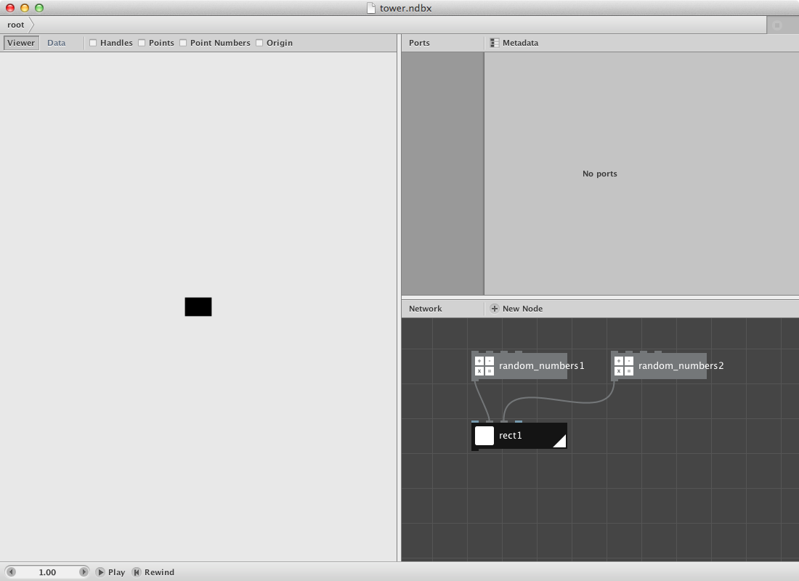

Now for the stack:

* Create a number node and set **Value** to **10.0**.
* Connect it to **Amount** of **random numbers1** and of **random numbers2**.
* Create a colorize node and connect rect1 to it. Change the strokecolor to white and enter **1.0** to **Strokewidth**.

The result is ten rectangles all on top of each other. We will have to create a procedure to stack them on each other with reference to its height value.

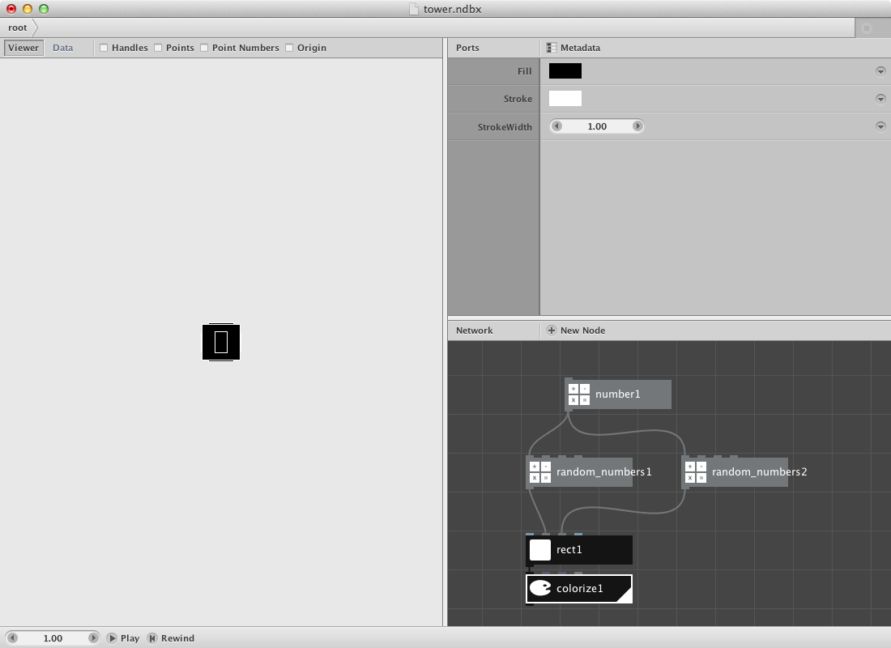

* Create a slice node and set **Start-index** to **0.0** and **Size** to **1.0**.
* Connect random number2 to it.
* Create a sum node and connect slice1 to it.

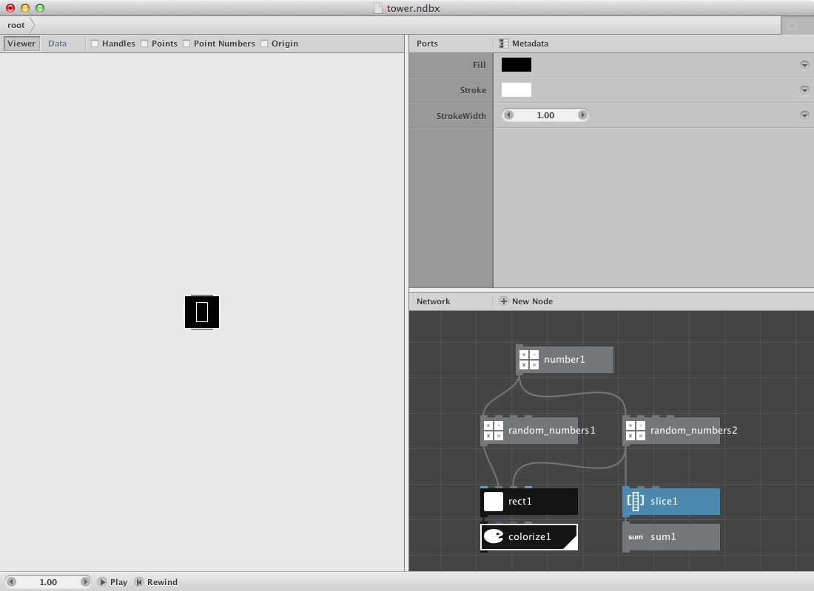

The idea is to make a sommation netwerk that returns the sum value for 0, 0-1, 0-2, 0-3, 0-4 and so on. We can do this by changing the **Size** value of slice1. Try it out and notice that the sum is higher with a higher size. We will do this as many times as there are numbers in random number2. Let's create a subnetwork to store this function in and to be able to send it a range of numbers.

* Select **slice1** and **sum1** by dragging over them.
* Right-click one of them and choose “group into network”.
* This will leave you with one node, subnet1. Right-click it again a rename it "accumulation" (by using right-click again).

Let's get back to the childnodes to implement a few modifications. I want to be able to send a number to the **Size** of slice1 so i need to **publish** this specific parameter. In addition i want to create a point based on this number. The idea is that the value can be used to push the y coordinate of each rectangle up based on the combined height of his predecessors. This means we have to negate the number and send it to a make point node.

* Right-click the accumulation node and select 'Edit Children'.
* Right-click on **Size** port of slice1, choose "Publish" and call it 'size'.
* Click on the root tab in the adress bar or right-click somewhere on the network view to choose "Go Up".
* Create a negate node and send sum1 to it.
* Create a make point node and send negate to **Y** port. Leave **X** at **0.0**.
* Render the make point node and go back to the root network.

Back in the root you should be able to see a modification in the accumulation node. It has an extra port that refers to the **Size**  of the internal slice node( the port is a gray one meaning it expects a value).

Now lets address a value to it.

* Create a range node and connent count1 to it's **End** port.
* This will result in a list of numbers starting from 0 and ending at the amount of count1.
* Connect range1 to **Size** port of the accumulation node.

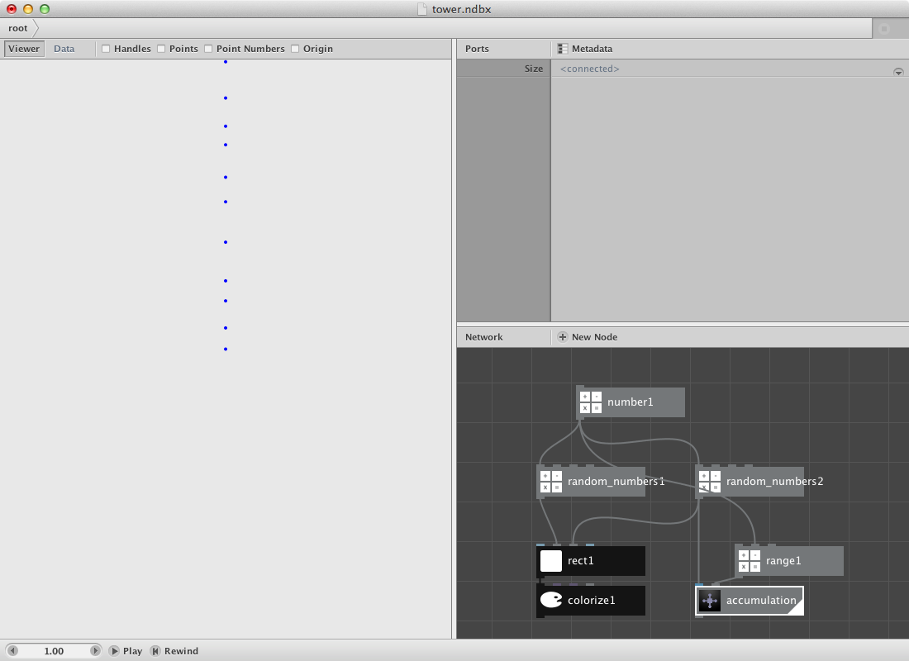

The next step is to use the points for the location of the rect.

* First create an align node and set **Valign** to **Bottom**. I want all rectangles to start on top of the origin point and then translate them. Connect colorize1 to it.
* Create a translate node. Connect align1 to it's **Shape** port and the accumulation node to it's **Translate** port.
* Create a group node to merge all paths into one geometry object. Send translate1 to it.
* Render group1.

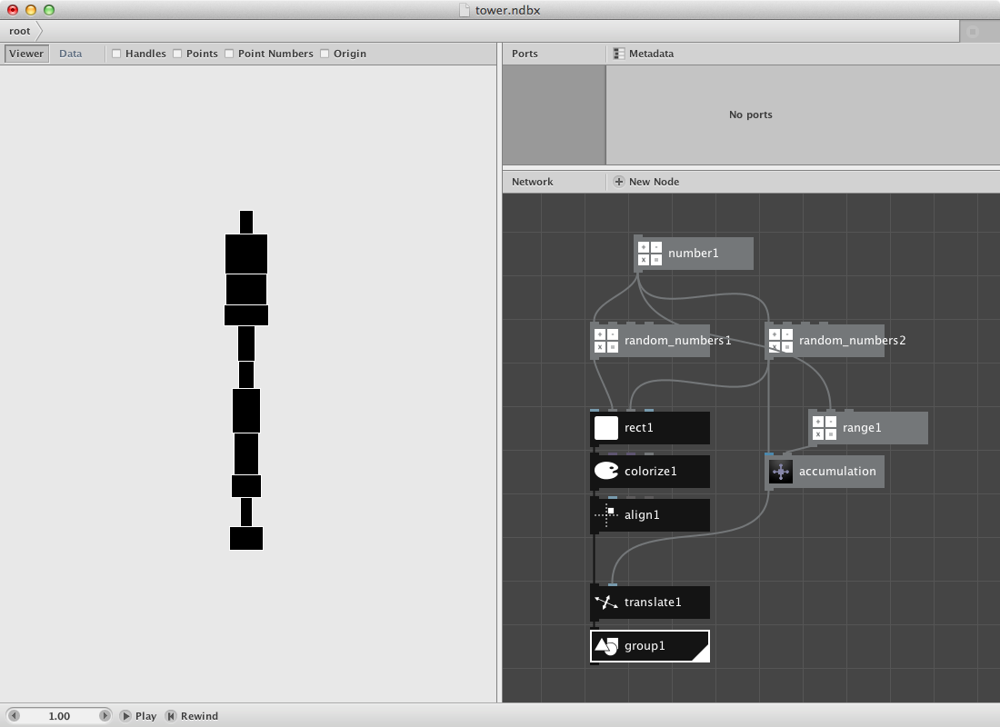

You can change the tower by:

* Changing **Value** of number1 which will add segments to the tower.
* Changing **Seed** of random numbers1 which will change the width of each segment.
* Changing **Seed** of random numbers2 which will change the height of each segment and calculate a new set of points based on these new values.
* Try it out first.

We will create a subnetwork from this procedure and publish some variables that will enable us to change the look of the tower.

* Select all by dragging over them.
* Right-click one of them and choose “group into network”.
* This will leave you with one node, subnet1. Right-click it again a rename it "tower" (by using right-click again).
* Right-click tower node and select 'Edit Children'.
* Right-click on **Value** port of number1, choose "Publish" and call it 'number-of-segments'.
* Right-click on **Seed** port of random numbers1, choose "Publish" and call it 'change-widths'.
* Right-click on **Seed** port of random numbers2, choose "Publish" and call it 'change-heights'.
* Click on the root tab in the adress bar or right-click somewhere on the network view to choose "Go Up".

The tower node has three ports:

* Change **Number Of Segments** to **13.0**.
* Change **Change Widths** to **6**.
* Change **Change Height** to **7**.

The new tower looks like this:

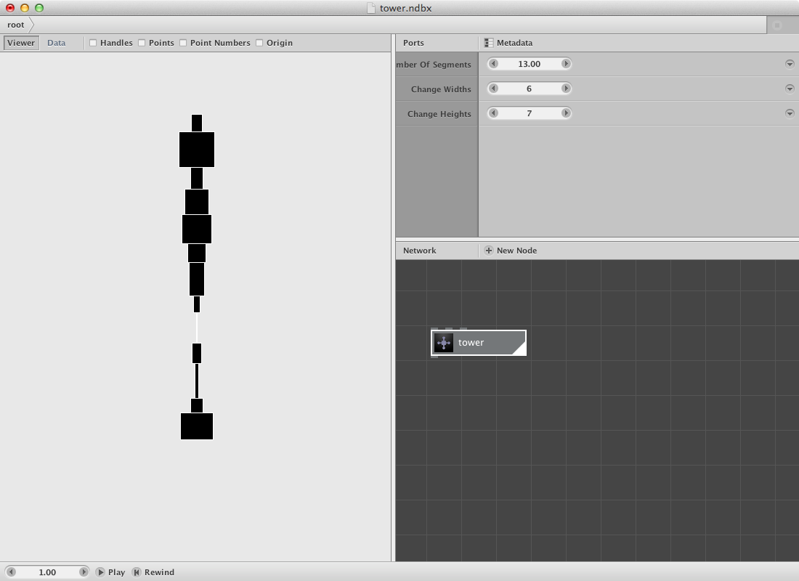

Read the [subnetworks page](../concepts/subnetworks.html) and try creating a serie of towers:

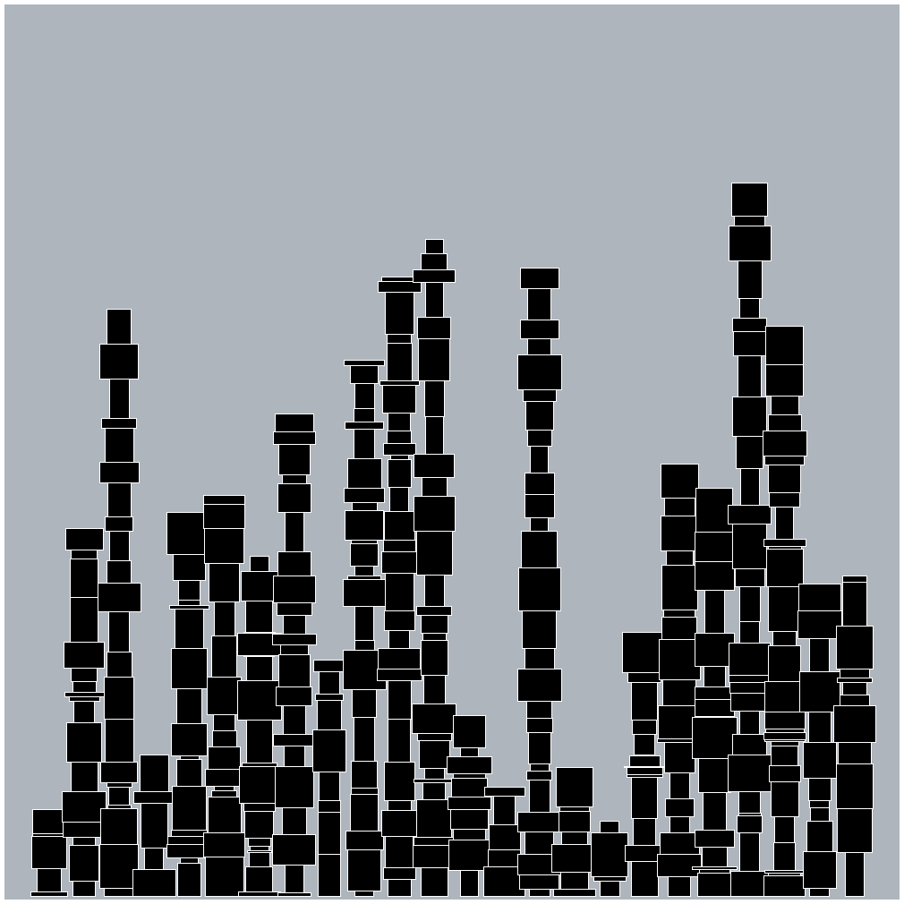

Changing the basic segment will change the complete building / city:

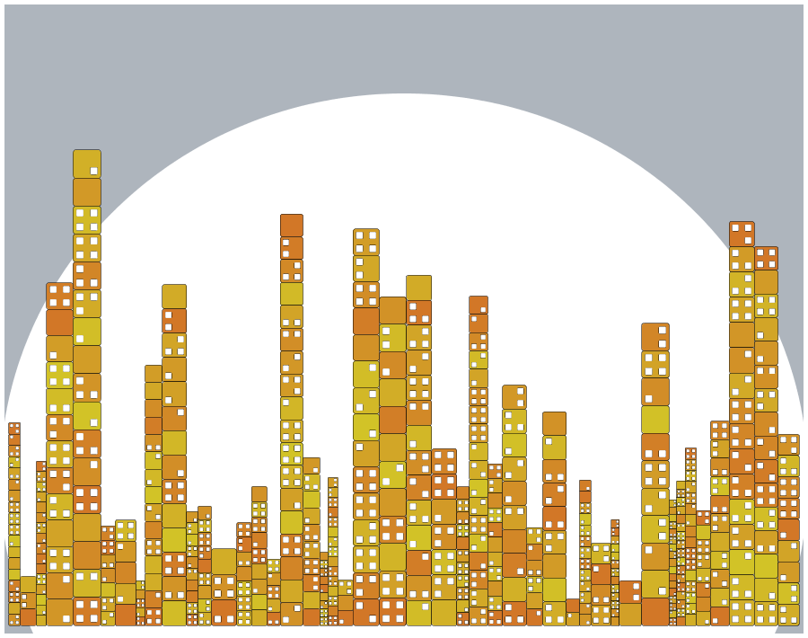

 

Styled Invader.
------------------

Suppose i want to recreate something like the invader example as decribed on the [subnetworks page](../concepts/subnetworks.html). In stead of using simple rectangles i will create a few shapes to work with.

* Create a rect node and set **Width** to **100.0** and **Height** to **100.0**. Additionally set **Roudness** to **20.0** and **20.0**.
* Create an other rect node and set **Width** to **100.0** and **Height** to **150.0**. Change the **position** on the x-axis to **50.0**.
* Create a rotate node and set the **angle** to **-45.0**. Connect rect2 node with this angle node.
* Create a compound node and send rect1 to the **shape1** port, send rotate1 to the **shape2** port. Set **function** to **Difference**.

Output should be the half of the original rectangle (rect1 node):

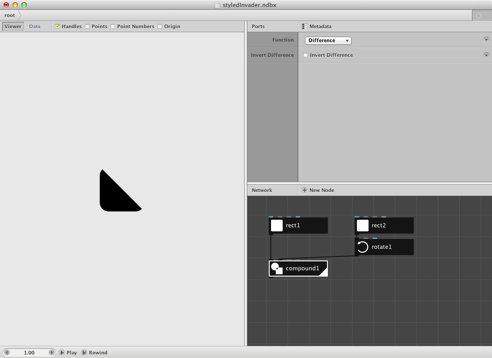

I want to be able to use this shape with a difference in rotation. Therefore:

* Create a rotate node. Connect compound1 to it.
* Create a range node. Set **Start** to **0.0**, End to **360.0** and step to **90.0**. Rendering this node will result in a list of numbers: 0,90,180,270.
* Connect range1 to the **angle** port of the rotate node. This will result in 4 paths (have a look at the **data** view to proof this right) all on top of each other but with a variety in rotation. The first one rotates 0 degrees, the second one 90 and so on.
* Create a colorize node and give a **Fill** color and a **Stroke** color. Make shure to set the **Strokewidth** which is **0.0** by default. Set it to **1.0**. The last step will enable you to see the layers better in the viewer pane.

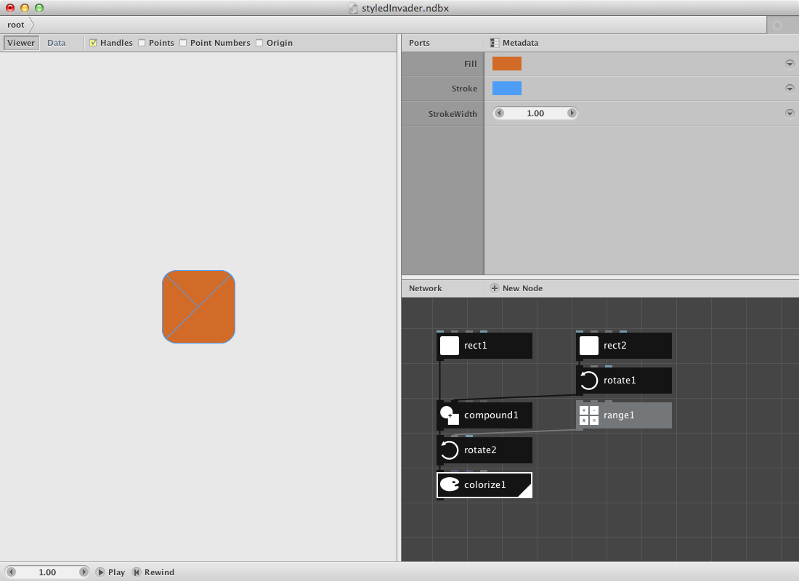

Now let's create something that may represent an eye. 

* Create an ellipse node. Set **Width** to **80.0** and **Height** to **80.0**.
* Create a compound node. Connect rect1 to **Shape1** and ellipse1 to **Shape2**. Set the function to **Difference**.
* Create a colorize node. Connect compound2 to it's **Shape** port.
* I will use ellipse1 for the pupil as well. Create a scale node and set **Scale** to **20.0** and **20.0**.
* Create a combine node and send colorize2 to it's first port, scale1 to it's second one.
* The output of combine1 consists of two paths. Create a group node and send combine1 to it to create a geometry object.

In a later stage i want to be able to select one of these shapes. Next few nodes make this happen:

* Create a combine node and connect colorize1 to it's first port. Connect group1 to it's second one.
* Create a slice node and connect combine2 to it. Set **Size** to **1**. Change the **Start_index** to obtain a different path. From 0 to 3 will select the triangle shapes with their difference in rotation. 4 will return the 'eye' shape.

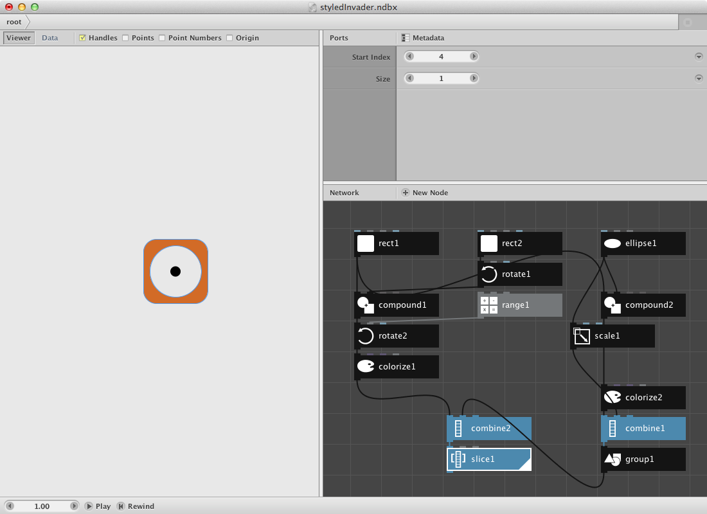

Our network is getting a bit big so let's create a subnetwork.

* Select all nodes by dragging over them.
* Right-click one of them and choose “group into network”.
* This will leave you with one node, subnet1. Right-click it again a rename "unit".

Let's get back to the childnodes to implement a few modifications. I want to be able to send a number to the **Start_index** of slice1 so i need to **publish** this specific parameter. I also want to be able to give a unit a location so i will have to implement and publish a translate node:

* Right-click on **Start_index** port (in the networkview) of slice1 and choose "Publish" and give it an appropriate name.
* Create a translate node. Connect slice1 to it's **shape** port.
* Right-click on **translate** port of this new translate node and select "Publish". Select it as rendered node.
* Click on the root tab in the adress bar or right-click somewhere on the network view to choose "Go Up".

Back in the root you should be able to see a modification in the unit node. It has two port: a first one referring to the **Start_index** (a gray one meaning it expects a value) and a second one to **Translate** (a blue one meaning it expects a point).

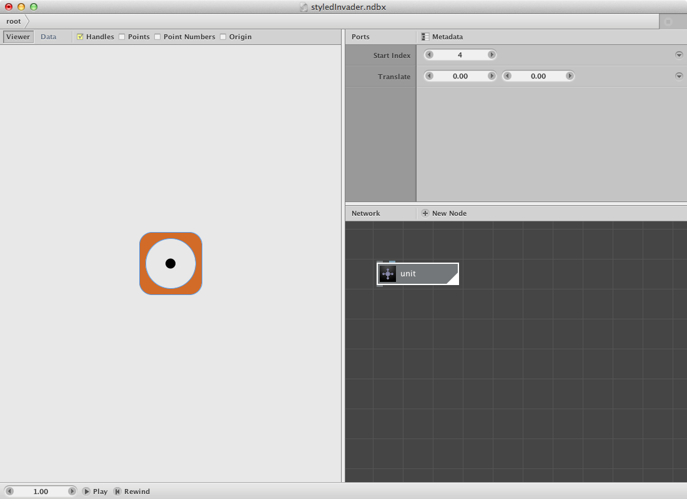

This new unit node will be placed on certain locations of a grid. 

* Create a grid node and set **Rows** to **3**, **Columns** to **4**, **Width** to **200.0** and **Height** to **300.0**.
* Creat a pick node. Connect grid1 to it and set **Amount** to **8**.

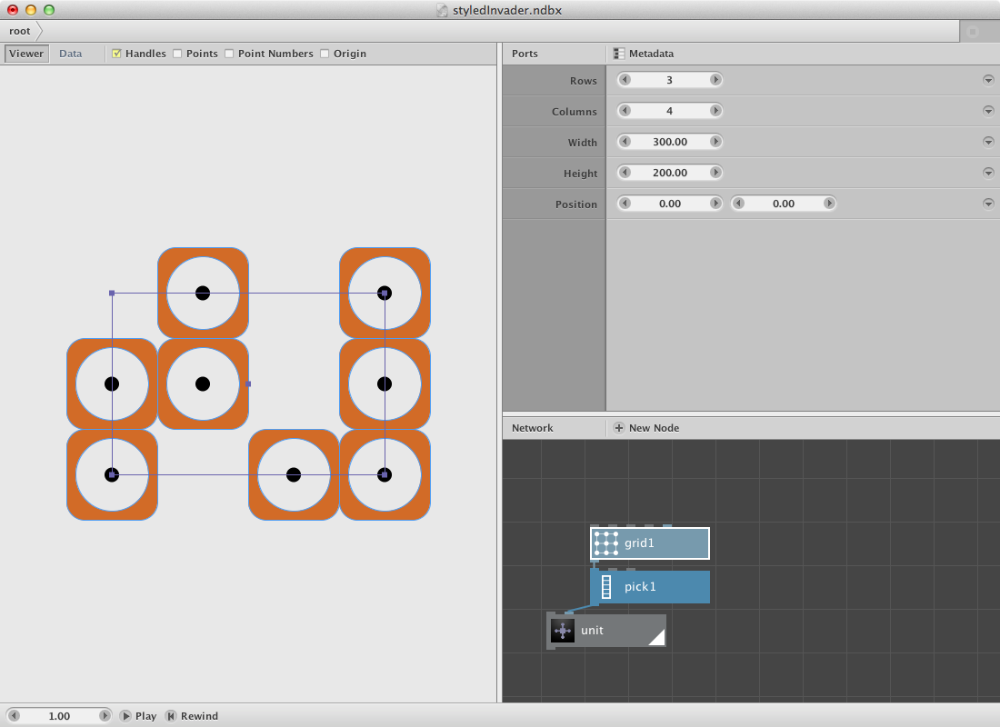

Let's introduce a procedure that does not always pick the same unit but picks a random one instead. First we need to know how many times a unit has to be created. We can count the amount of pick1.

* Create a count node and connect pick1 to it.

Based on this count we can create an amount of random numbers varying between 0 and 4 (remember that on 0 till 3 were the triangle shapes and on 4 was the eye)

* Create a random numbers node and connect count1 to **Amount** port. This will result in a number of random floating numbers.
* To convert it to integers (we can not select piece 3.41) create a to integer node. Connect random numbers1 to it. This should result in a list of absolute numbers between 0 and 4.
* Connect to integer1 to **start_index** port.

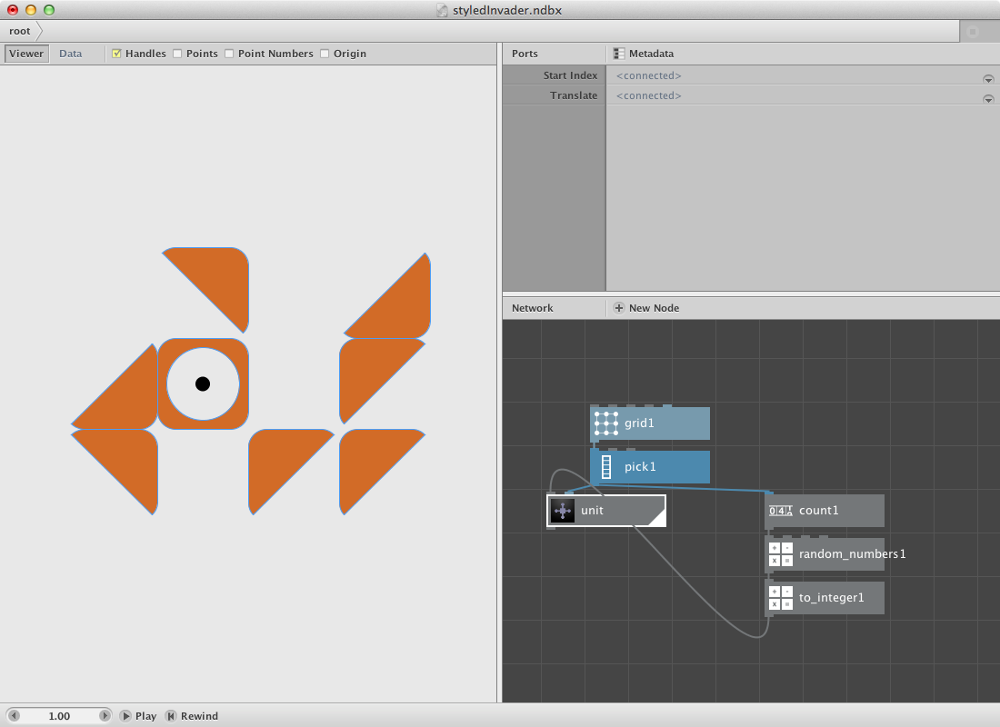

Change the **Seed** of pick1 to create another result.

This is half of the result. Next step is to align it to the right side of the origin. In order to do this **an important step** has to be made: render the unit node and have a look at the **Data** tab in the viewer pane. Notice that there are 8 paths in the list: 1 for each unit. If we would align this as is it would result in a similar aligment for all units. To avoid the translate information we will have to group these 8 paths into a single geometry path. 

After the alignment we will reflect it to obtain an invader. Last step is an implementation of a snap node which will change the shapes over a snapping procedure.

* Create a group node and connect the unit node to it.
* Create an align node and set **Halign** to **Left**. Connect group1 to it: the shape should shift to the right side of the origin.
* Create a (black) reflect node and set **Angle** to **90.0**. Connect shape1 to it.
* Create a snap node and set **Distance** to **150.0** and **Strength** to **50**.
* Render snap1 node and change **Seed** of **pick1**.

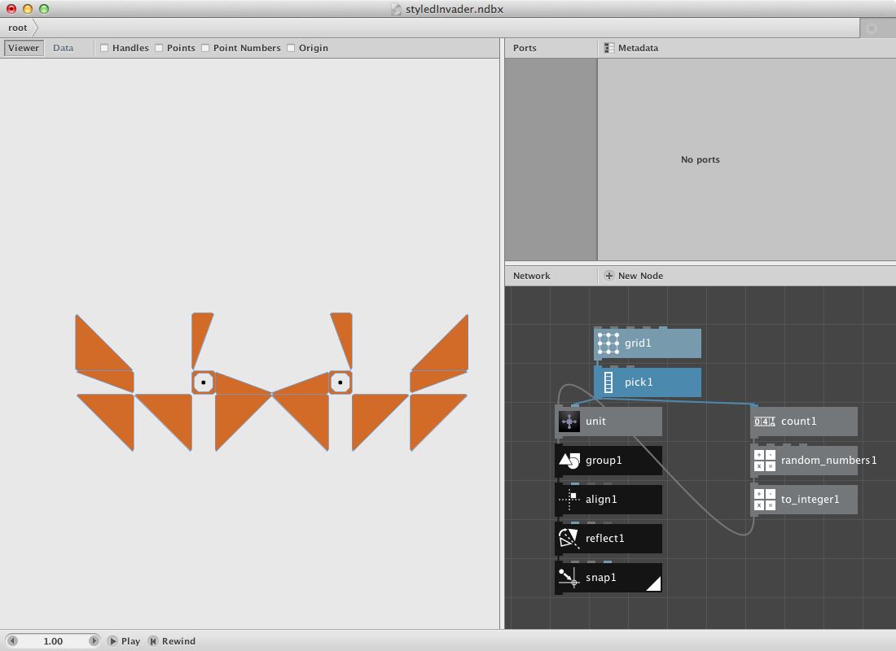

Let's create a few of them. 

* Select all the nodes and right-click to 'Group into network'. Rename it to invader.
* Right click it again and 'Edit Children'.
* Publish **Seed** of pick1 and name it seeda. 
* Publish **Seed** of random numbers1 and name it seedb.
* Go back to the root network: the invader has two ports now.
* Create a grid node and set **Rows** to **5**, **Columns** to **1**, **Width** to **700.0** and **Height** to **1700.0**.
* Create a count node and connect grid1 to it.
* Create a range node. Connect count1 to its **End** port.
* Connect range1 to **Seeda** and **Seedb**.
* Create a translate node. Connect invader to **Shape** and grid1 to **Translate**. Render it.

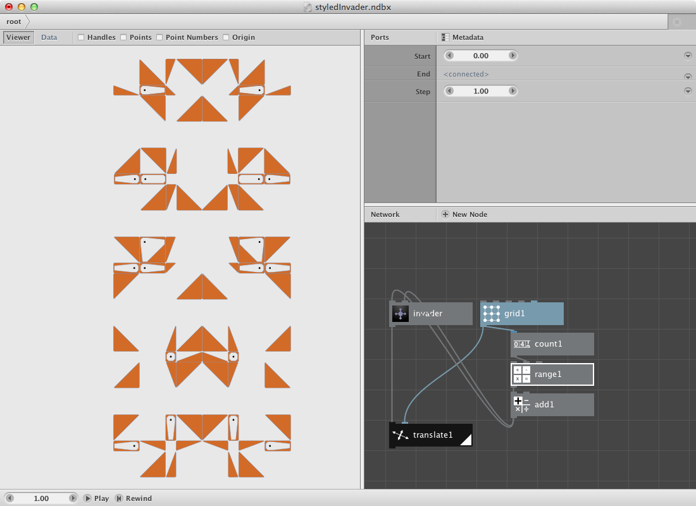

Below is the same procedure with a few modifications. A shadow was added and the 'invadergrid' was altered by rows, columns and dimension.

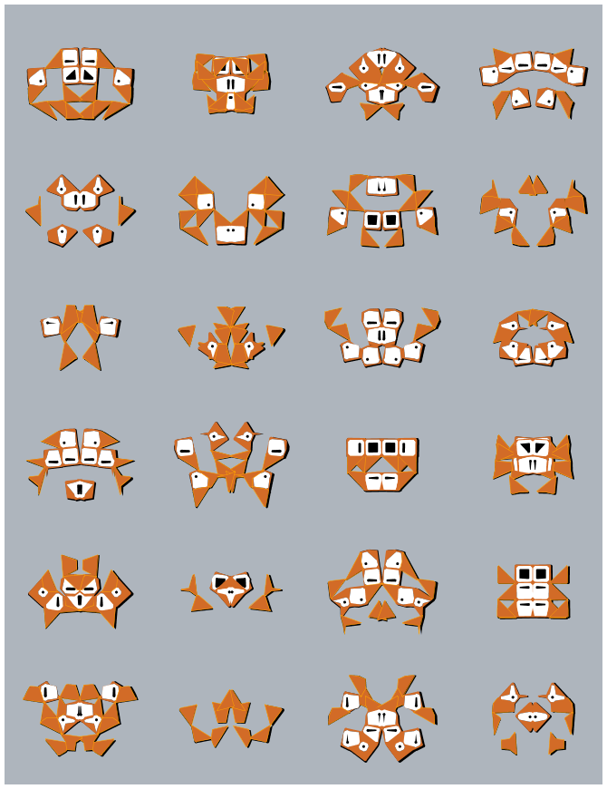

