First things first.
-------------------
Before starting this section you should:

* [Learn about NodeBox concepts](../concepts/concepts.html).
* [Learn about random](../concepts/randomness.html): to learn how randomness works in NodeBox.
* [Learn about subnetworks](../concepts/subnetworks.html).

Math operations.
------------------

Nodebox allows a range of arithmetic operations suchs as multiply, divide, add, subtract. The nodes representing these functions can be used for instance to add numbers together but can also be used within more complex operations. In the following example we will have a look at a network which will create a set of hairs on a shape.

* Create an ellipse node and leave all parameters as default.
* Create a [scatter node](/node/reference/corevector/scatter.html) and set **Amount** to **1500**

The idea is to create a network which grows hair on all these points. In order to give it a location from which the hairs should grow away from, we will implement a [make point node](/node/reference/corevector/make_point.html) with **X** set to **0.0** and **Y** also set to **0**. This node will allow us to change the direction of each hair later in the process.

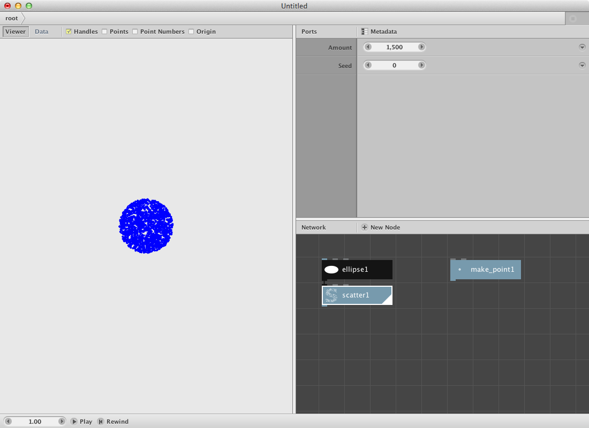

Since the scatter node and the make point node contain point elements we will need a node to define the x and y values as a seperate list. Therefore:

* Create 4 [lookup nodes](/node/reference/data/lookup.html). Set the key parameter for the first one to **x**, for the second one to **y**, the third one again **x** and finally the forth one again to **y**.
* Connect scatter1 to lookup1 and lookup2.
* Connect make point1 to lookup3 and lookup4.
* Render the lookup1 node and have a look at the result (a list of all the x values for each point in the scatter1).

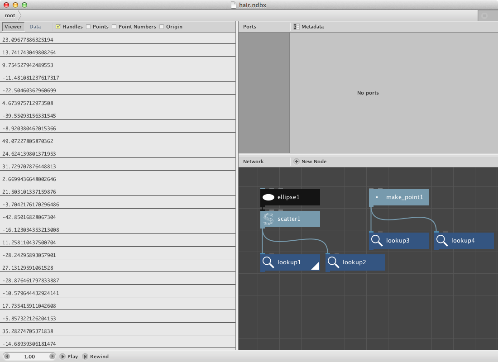

Now we will subtract the x value of the make point1 node to each of the x values of the scatter1 node. We will do the same for the y values.

* Create two [subtract nodes](/node/reference/math/subtract.html).
* Connect lookup1 with **Value1** and lookup3 with **value2** for the first subtract node.
* Connect lookup2 with **Value1** and lookup4 with **value2** for the second one.

These new values will be used as the length of each hair. In order to be able to change that length:

* Add two [divide nodes](/node/reference/math/divide.html)
* Send subtract1 to the first one
* Send subtract2 to the second one.
* Change the **Value2** into **2.0** meaning we will take half of the original size.

Now we will add these values to the original x and y values of the scatter node and convert them into a set of new points.

* Add two [add nodes](/node/reference/math/add.html).
* Connect lookup1 with **Value1** and divide1 with **Value2**.
* Connect lookup2 with **Value1** and divide2 with **Value2**.
* Create a make point node.
* Connect add1 to **X**
* Connect add2 to **Y**

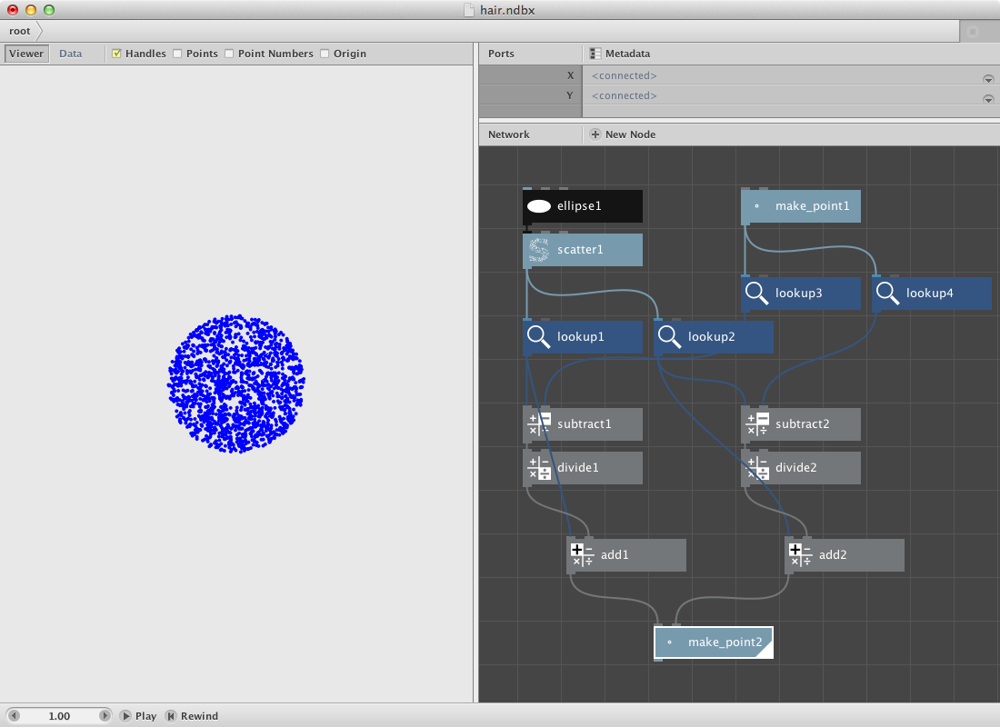

In order to create the hairs add a [line node](/node/reference/corevector/line.html)

* Connect scatter1 with **Point1**.
* Connect make point2 with **Point2**.

This should be the result:

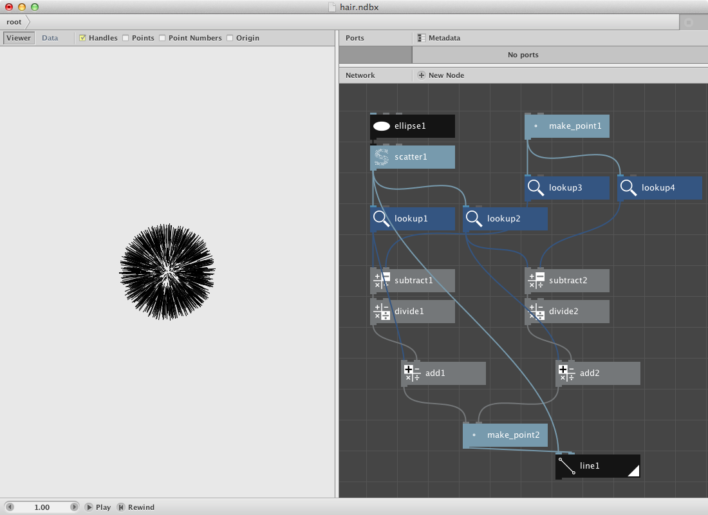

Try out:

* Changing the original ellipse with an other shape like a rectangle or a textpath to obtain a hairy rect / text.
* Changing the x and y values of the make point1 node to have a difference in hair implant.

Comparisons.
----------

Suppose you want to create a set rectangles that vary in dimensions but get a color based on the average of all the dimensions. Nodebox allows you to do comparisons by using the [compare node](/node/reference/math/compare.html).

First let's create a set of random numbers and calculate the average of them. We will use the amount of numbers of a grid to specify the amount of the random numbers.

* Create a grid node. Leave it at it's default settings.
* Create a count node. Connect grid1 to it.
* Create a random numbers node. Set **Start** to **15.0** and **End** to **35.0**. Connect count to **Amount**.
* Create an [average node](/node/reference/math/average.html). Connect random_numbers1 to it.

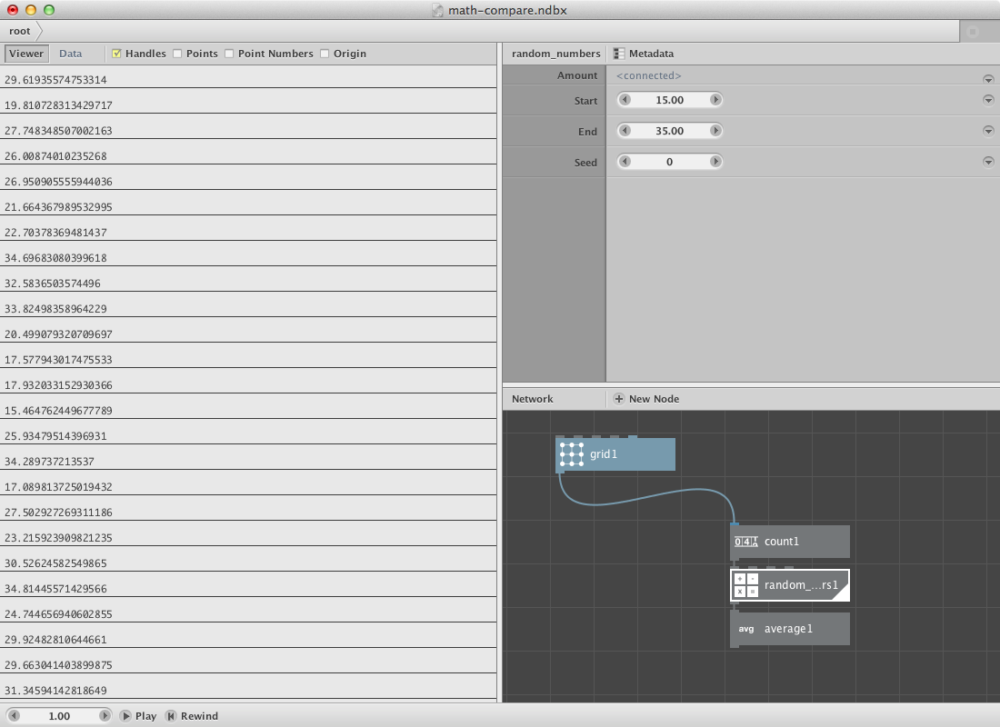

We will use the random numbers as dimensions for a rectangle placed on each point of the grid. We will also compare the random numbers with the average number so we can use this information (boolean True-False) to pick a color from a set of colors.

* Create a rect node. Connect grid1 to **Position**, connect random_numbers1 to **Width** and **Height**.
* Create a colorize node. Connect rect1 to **Shape**. It will be used later to change the fill color.
* Create a compare node. Connect random_numbers1 to **Value1** and average1 to **Value2**. Set **Comparator** to **smaller than**. The values smaller than the average value get return true, all other return false.

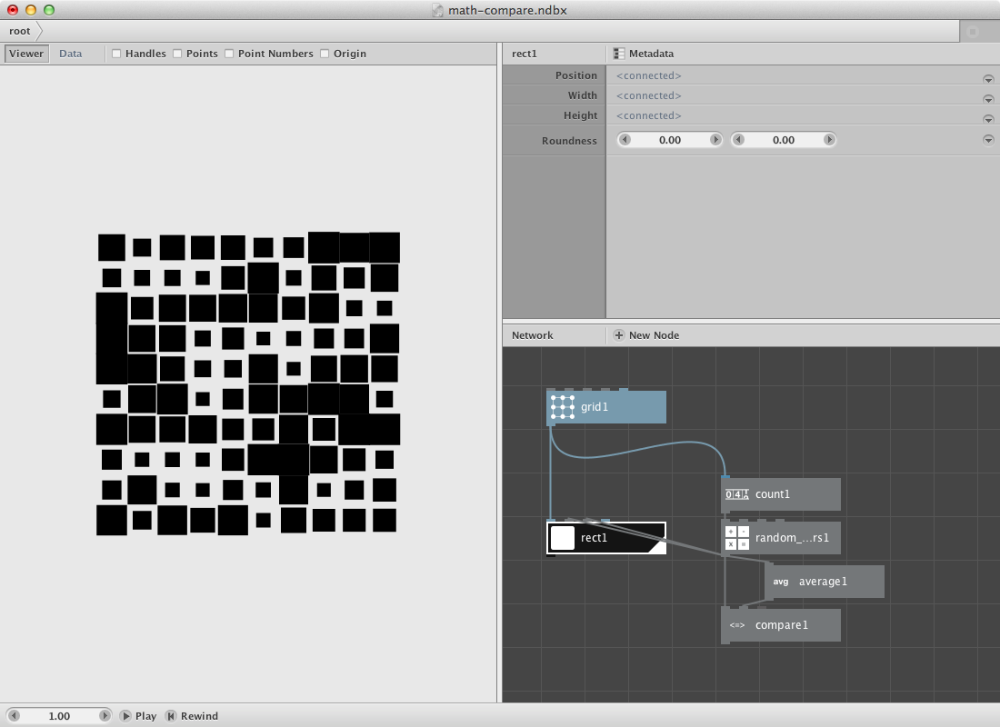

Now for the color part. All rectangles smaller than the average should get one color, the others an other color. 

* Create a multiply node. Connect compare1 to **Value1**. Set **Value2** to **1.0**. True / False will come out as 1 / 0.
* Create two color nodes and create two different colors.
* Create a combine node and connect the two color nodes to **List1** and **List2**.
* Create a slice node. Set **Size** to **1** and connect combine1 to **List**. Connect multiply1 to **Start_index**. 
* Connect slice1 to **Fill** of colorize1.

Try to change it so the bigger rectangles change into an ellipse of the same dimensions and color.

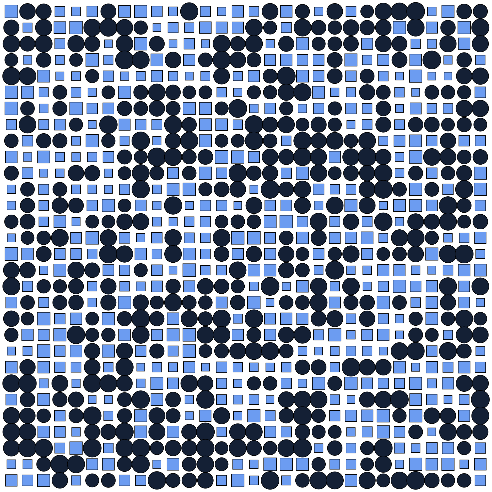

Math and paths.
------------------

Nodebox allows you to create a range of different paths and functions based on sine and cosine. The next example shows how to create a Lissajous path which is based on the parametric equations

    x = A*sin(at+δ)
    y = B*sin(bt+γ)

Lissajous curves can be seen on oscilloscopes and are the result of combining 2 trigonometric curves at right angles.

Create a [sample node](/node/reference/math/sample.html) to start with a set of numbers.

* Set **Amount** to **1000**.
* Set **End** to **15.00**.

Create two [multiply nodes](/node/reference/math/multiply.html) and send the sample node to each one of them.

* Set **Value2** to **10.84** for the first one.
* Set **Value2** to **10.00** for the second one.

Create two [sin nodes](/node/reference/math/sin.html) and send the multiply nodes respectively to the first one and the second one.

Create two more multiply nodes and send the sin nodes to them. These two multiply nodes will handle the width and height of the Lissajous path. You can rename them by using right click and select the rename option.

Create a [make point node](/node/reference/math/make_point.html).

* Send the first multiply node to the x port.
* Send the second one to the y port.

Create a [connect node](/node/reference/corevector/connect.html) and send the make point node to it. Finnally create a [colorize node](/node/reference/corevector/colorize.html) to give the path a fill and stroke color.

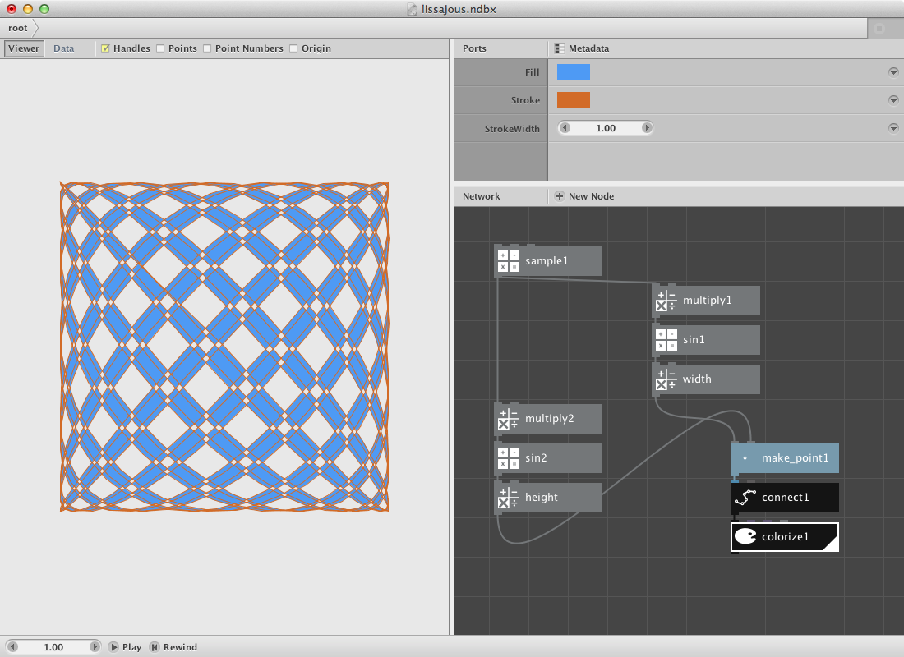

Writing Filters.
------------------

Nodebox can be used to write more complex functions. We described a hair filter as the first example on this section. Below we will describe another two of them. 

A first one we will call the web filter. The idea is to create a subnetwork that draws lines between points based on their distance and on a secondary selection.

We need a shape and the resampled points of it first.

* Create a textpath node. Set **Text** to **Web**, **Fontsize** to **120.0** and select a font.
* Create a resample node and connect textpath1 to it. Set **Length** to **8.0**.
* Create a point node and connect resample1 to it.

The idea is to build a network for each point of the list that calculates the distance to each other points. We will select a few of them later to draw a line between the point and each one of those selected points.

* Create a slice node. Set **Size** to **1**. This will be our control point. We can scroll throught them by changing the **Start Index**.
* Create a sort node. Mind that you select the right one: the description says 'Sort points or shapes using different sorting methods.' 
* Connect point1 to **Shapes** and slice1 to **Position**. 
* Create a second slice node. Set **Size** to **8**. Connect sort1 to it.
* Create a pick node. Set **Amount** to **5** and connect slice2 to it.

Previous procedure sorts all points by distance from the control point. The second slice node selects the first 8 and pick1 select 5 out of these. Now we will draw a line between the control point and the selected points

* Create a line node. Connect pick1 to **Point1** and slice1 to **Point2**.

Now the function get evaluated for 1 point. Change **Start_index** of slice1 to see the result for an other point. We will create a subnetwork to do it over all points.

* Select slice1, sort1, slice2, pick1 and line1. Right-click and **Group into network**.
* Right-click it again and rename it webby.
* Right-click it a last time and **Edit Children**.
* Publish **Start_index** of slice1 and of slice2. Call them **Start index** and **Size**. The network should look like below.
* Go back to the root.

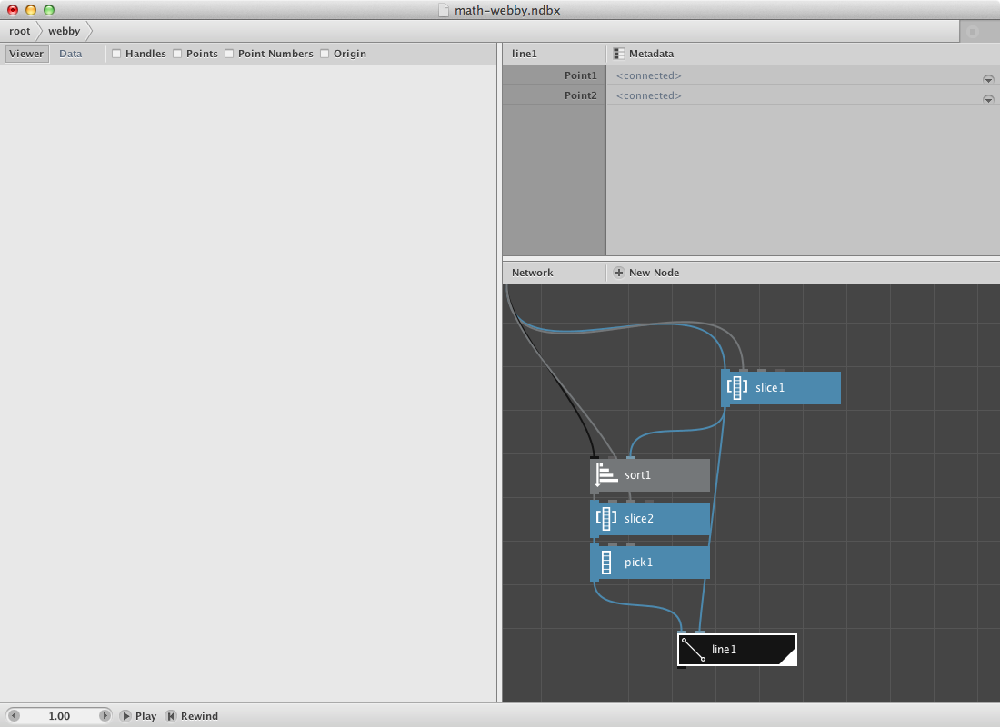

The creation of the subnetwork now allows us to evaluate it for each point. We will increase the number of **Start_index** of webby to do that. Let's build a range.

* Create a count node. Connect point1 to it.
* Create a range node. Connect count1 to **End**.
* Connect range1 to **Start_index** of webby.
* Render webby.

You can increase the number of the secondary selection on webby itself. You can change the number of points by changing **Length** of resample1.

Try implementing color to it.

The webfilter applied on [this svg](http://en.wikipedia.org/wiki/File:Obama.svg) of Obama.

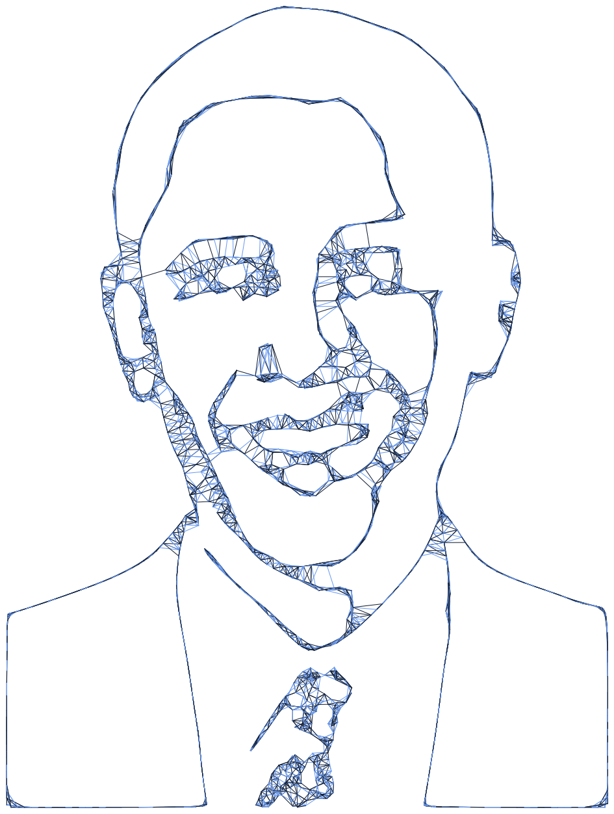

As a second filter we will create a subnetwork that will calculate the closest point for a set of random points. We will visualize it by connecting both points to each other with a line.

* Create an ellipse node. Set it's dimensions at **300.0** by **300.0**.
* Create a scatter node. Connect ellipse1 to **Shape**. Set **Amount** to **40**.
* Create a sort node. Send scatter1 to **Shapes**.
* Create a slice node. Send scatter1 to **List** and set **Size** to **1**. Connect its output to **Position** of sort1.
* Create a shift node. Set **Amount** to **1** and connect sort1 to **List**. We want the point with the shortest distance but not itself.
* Now we will select the first point over a [first node](/node/reference/list/first.html). Create one and send shift1 to it.
* Create a line node. Connect first1 to **Point1** and slice to **Point2**.
* Render it.

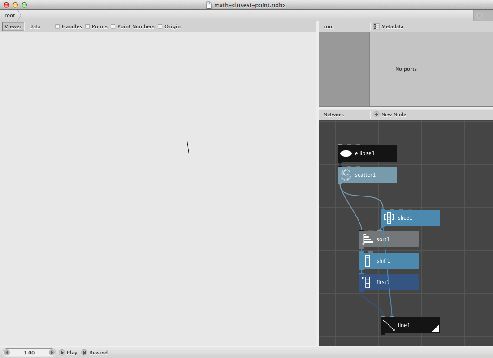

Now we will turn this procedure into a subnetwork so we can evaluate every point instead of just one.

* Select all nodes except ellipse1 and scatter1. Right-click them and **Group into network**.
* Right-click it again and rename it closest_point.
* Right-click it a last time and **Edit Children**.
* Publish **Start_index** of slice1. Call it **Start index**.
* Go back to the root.
* Create a count node and connect scatter1 to it.
* Create a range node. Connect count1 to **End**.
* Connect range1 to **Start_index** of closest point node.
* Render closest point node.

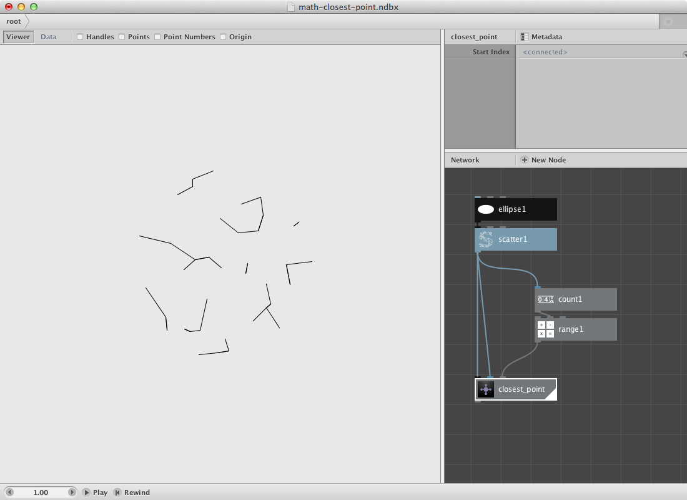

Same Obama, different filter. Some modifications on color and strokewidth.

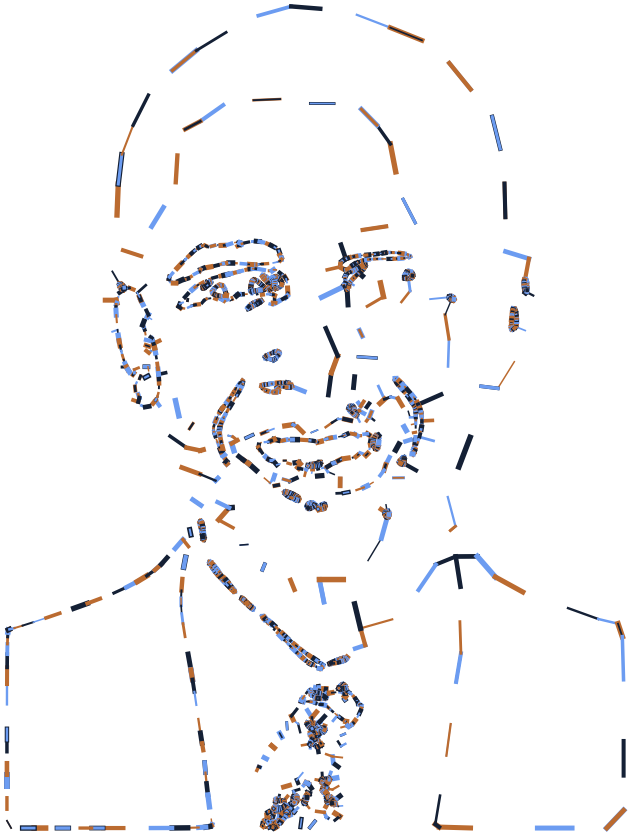

